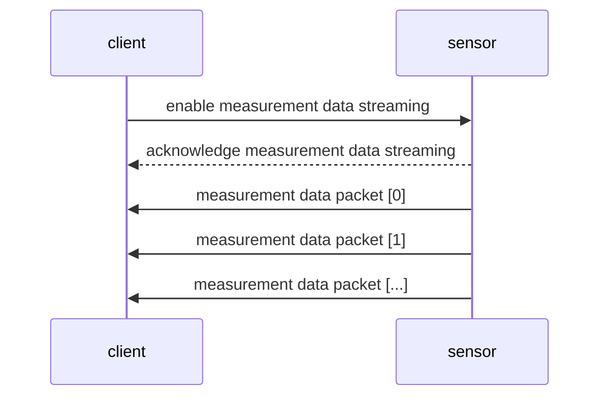
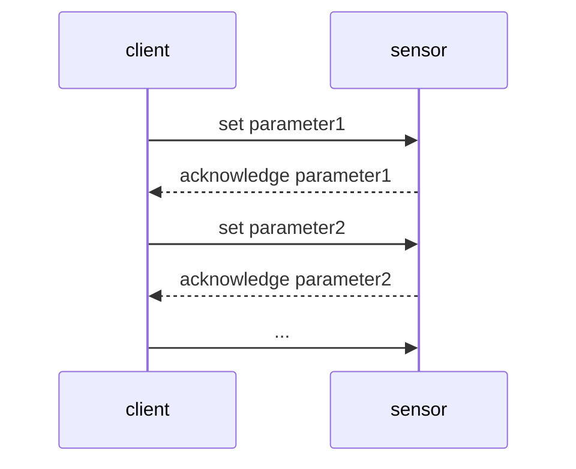

 

LiDAR API Documentation
---

</br>

:red_circle: This document is on DRAFT stage! :red_circle:

</br>

This description covers all possibilities to work with the following sensors: 

- [**multiScan100**](https://www.sick.com/multiScan100) 
- **picoScan150**

1. You have your sensor on hand and want to start directly? [Kick start here](#getting-started-to-work-with-a-sensor) :rocket:
2. You are searching informations that help to integrate your sensor? [Click here](#general-information)

</br>

That document provides you informations about the following topics:


<details>
<summary>Table of content</summary>

[[_TOC_]]

</details>


</br>
</br>

# Introduction
If you want to integrate our sensor into your system, you are at the right place. The following will introduce you to the basics of LiDAR connectivity. You will learn which sensor parameterisation options you can use and how to access the sensor's measurement data.

## picoScan
The picoScan is a compact 2D LiDAR sensor from SICK. The 2D LiDAR sensor is considered the successor to the very successful TiM series. The picoScan is superior to its predecessor in almost all disciplines. With a longer range, better resolution and new features such as reflector detection, SICK is setting new standards for its 2D LiDAR sensors.

## multiScan 

The [multiScan](https://www.sick.com/multiscan) is a 3D LiDAR sensor from SICK. The sensor has 16 scan layers to detect objects and people in detail. The multiScan offers 360° all-round vision and a large vertical aperture angle to cover a large working area.

</br>
</br>

# General Information

## IP addresses and ports

The default IP address for the sensors, if not specified different is `192.168.0.1`.

| Usage     | Default Port |
| --------- | ------------ |
| HTTP      | `80`         |
| WebSocket | `80`         |
| CoLa A    | `2111`       |
| CoLa B    | `2112`       |
| CoLa 2    | `2122`       |

</br>

## Drivers and SDKs

 

In case you prefer to use complete drivers instead of single telegrams, the following options are available:

- [ROS drivers](https://github.com/SICKAG/sick_scan_xd)
- [ROS2 drivers](https://github.com/SICKAG/sick_scan_xd)
- [Python drivers](https://github.com/SICKAG/sick_scan_xd)
- [C++ drivers](https://github.com/SICKAG/sick_scan_xd)

</br>

## Communication concepts

The LiDAR API documentation differentiates between two communication concepts. For both cases there are multiple ways to work with the sensor.

### Receive event-driven measurement data streaming

  - [COMPACT Format via UDP](#compact-format)
  - [MSGPACK Format via UDP](#msgpack-format)
  - [ScanData via WebSockets](#websocket)

Communication concept of measurement data streaming:



### Read or write sensor parameters

  - [HTTP/REST](#httprest)
  - [CoLa](#cola)

Communication concept of sensor configuration:



</br>

# Getting started to work with a sensor

## :zero: Prerequisites 

:heavy_check_mark: SICK sensor (e.g. multiScan100)

:heavy_check_mark: Power cable 

:heavy_check_mark: Ethernet cable to connect the sensor to your system

</br>

## :one: Connect device to your system

1. Connect the power supply to the device. Make sure that the sensor is supplied with voltage (green light).
2. Connect the Ethernet to the sensor. Connect the other end of the Ethernet line to a PC.

:white_check_mark: If you have done everything correctly, the sensor will now start up.

</br>

## :two: Open the web GUI

1. Open the browser on your PC.
2. Enter the ip address of the sensor (default ip address: http://192.168.0.1/).

:white_check_mark: The Web GUI should now be shown.

> :question: You can't connect to your sensor?
>
> Make sure that the entere ip address ist that of the sensor.
>
> If it still doesn't work, make sure your sensor and client system are in the same subnet. You can either change the subnet of the sensor or that of your client system.
>
> 1. [Change subnet of client system](#change-subnet-of-client-system)
> 2. [Change sensor ip address](#change-sensor-ip-address)

</br>

## :three: Working with the web GUI

To change the settings, you must log in with the appropriate user level.

| # User level | User level             | password     |
| ------------ | ---------------------- | ------------ |
| 1            | Operator               | -            |
| 2            | Maintenance personnel  | main         | 
| 3            | Authorized Client      | client       |
| 4            | Service                | servicelevel |

:white_check_mark: When you are logged in, you can make changes in the web GUI.

</br>

## :four: Decide how you want to work with the device

**Case 1**: You want to test the device and change some settings with the given web browser.
  - You are ready to got and do not need any further actions.

**Case 2**: You want to integrate the device into a ROS environement (ROS / ROS2)
  - Please refer to our [ROS drivers](https://github.com/SICKAG/sick_scan_xd).

**Case 3**: You want to use an existing driver (C++ or Python)
  - Please refer to our [C++ / Python driver](https://github.com/SICKAG/sick_scan_xd).

**Case 4**: You want to build your own driver in specific programming language.
  - Decide which measurement data straming approach you want you use. You can choose from these:
    - [COMPACT Format via UDP](#compact-format)
    - [MSGPACK Format via UDP](#msgpack-format)
    - [ScanData via WebSockets](#websocket)
  - Decide which sensor configuration approach you want you use. You can choose from these:
    - [HTTP/REST](#httprest)
    - [CoLa](#cola)

</br>
</br>

# Sensor Configuration

## Choice of configuration method

|                 | When to use what                                                                                     |
| --------------- | ---------------------------------------------------------------------------------------------------- |
| **HTTP/REST**   | - if you only want to read data </br> - if your system can handle a challenge and response process         |
| **CoLa**        | - if your system cannot handle a challenge and response process </br> - it is the best fit for PLCs. |

</br>

## HTTP/REST

> Background Information:
> TCP is a transport-layer protocol that ensures reliable data transmission, HTTP is an application-layer protocol that is used to transmit data over the internet, REST is an architectural style for building web services that is based on the principles of HTTP, and OpenAPI specification (formerly known as Swagger) is a specification for building RESTful web services that helps to ensure consistency and ease of use for developers.

</br>

### OpenAPI Specification

 

The use of an [OpenAPI Specification](https://spec.openapis.org/oas/v3.1.0) brings several advantages.

:+1: Improved documentation: OpenAPI provides a standardized format for documenting APIs, making it easier for developers to understand and use the API. It's easy to navigate the endpoints, query parameters, request and response payloads, and other details of an API.

:+1: Code generation: OpenAPI specifications can be used to generate code in a variety of programming languages, which can speed up the development process and reduce the risk of errors.

:+1: Testing: OpenAPI specifications can be used to test sensors fast and easily.

:+1: Interoperability: OpenAPI is an open-source and vendor-neutral specification, which means that APIs written in different languages and frameworks can be described using the same format, making it easier to integrate them with other systems.

:+1: Tooling: OpenAPI specification is widely adopted and supported by various tools, frameworks and libraries, which can make it easier to work with an API that has an OpenAPI specification.

:+1: Community: OpenAPI has a large community of developers, which means that there is a lot of support and resources available for working with OpenAPI.


Please refer to the following OpenAPI Specifications. These are used to describe the HTTP interface of the listed sensors. The majority of HTTP requests can be used among all listed sensors. Due to hardware specifics some HTTP requests are only valid for some sensors.

- :link: [General OpenAPI Specification](device-configuration/rest/openapi-picoScan.json)


</br>

### Challenge and response process
To prevent unauthorized access, the HTTP interfaces underlies an Challenge-response process. It is a participant’s secure authentication process based on knowledge. For this purpose, a participant poses a challenge to which others have to respond in order to prove that he or she knows a certain shared secret without having to transmit this information themselves. This is protection against a password from being listened to by attackers on the line.

For this purpose, there are different detailed methods that are based on this basic principle: If one side (Alice) wants to be authenticated with respect to the other side (Bob), Bob sends a random number N (nonce) to Alice (Bob poses the challenge). Alice adds her password to this number N, applies a cryptological hash function or encryption to this combination, and sends the result to Bob (and consequently returns the response). Bob, who knows the random number, the shared secret (= Alice’s password) as well as the hash function used or encryption, carries out the same calculation, and compares his result to the response from Alice. If both files are identical, Alice is successfully authenticated.

 

*Overview challenge and response process*

</br>

#### Challenge and Response Python example

>**NOTE**
>- This is a simple example and you may want to add more error handling and more robustness to your final code.
>- For this sample code you need to install the python requests module (`$ pip install requests`)

<details>
<summary>Challenge and Response Python Example</summary>

```python 
import json
import hashlib
import struct
import requests

# login
username = 'Service'
password = 'servicelevel'

def __getAuthPostHeader(url, varname, value):
    # get challenge from sensor
    url = url + 'getChallenge'
    requestPayload = '{ "data": { "user": "'+ username + '" } }'
    r = requests.post(url, data=requestPayload)
    chal = r.json()
    
    # parse challenge response
    realm = chal['challenge']['realm']
    nonce = chal['challenge']['nonce']
    opaque = chal['challenge']['opaque']
    hstr1 = username + ":" + realm + ":" + password
    ha1 = hashlib.sha256(hstr1.encode()).hexdigest()

    # build strings and hashes for header
    methodType = 'POST'
    hstr2 = methodType + ":" + varname
    ha2 = hashlib.sha256(hstr2.encode()).hexdigest()
    hstr3 = ha1 + ":" + nonce + ":" + ha2
    response = hashlib.sha256(hstr3.encode()).hexdigest()
    
    # build payload
    payload = {}
    payload['header'] = {}
    payload['data'] = {}

    # fill payload
    payload['header']['user'] = username
    payload['header']['realm'] = realm
    payload['header']['nonce'] = nonce
    payload['header']['response'] = response
    payload['header']['opaque'] = opaque
    payload['data'][varname] = value

    return json.dumps(payload)

    #Example
    # {
    #     "header": {
    #         "user": "Service",
    #         "realm": "SICK Sensor",
    #         "nonce": "284ba8fbb07d440a9532f751459490e6d8a35a4e9d93695e4d446d0f713451cc",
    #         "response": "c38218aa7601ad13dfb9a9ef556c7102c8a7a84ef7dc54d059e7df6a73ba509a",
    #         "opaque": "9b65dcbba17f5ad588b1220b55e3f31b2c469d5e986d3674ed2d0df2ce54a867"
    #     },
    #     "data": {
    #         "ScanDataEnable": true
    #     }
    # }

def getVariable(url, varname):
    r = requests.get(url + varname)
    return(r.json())

def postVariableAuth(url, varname, value):
    payload = __getAuthPostHeader(url, varname, value)
    b = requests.post(url + varname, data=payload)
    return(b.text)


# MAIN ------------------------
url = 'http://192.168.0.1/api/' # must end with '/'

# GET
res = getVariable(url, 'ScanDataEnable')
print(res)

# POST with Authentication
res = postVariableAuth(url, "ScanDataEnable", True)
print(res)

# GET
res = getVariable(url, "ScanDataEnable")
print(res)
# -----------------------------
```

</details>

</br>

### Insomnia Collection

Sometimes it is helpful to test an interface with a REST client like Insomnia. If you want to write a sensor parameter via REST, you must first log in and pass a corresponding header via a challenge response procedure for each write operation.

To make this easier you can use this Insomnia [plugin](device-configuration/rest/insomnia-plugin-srt-rest.zip) and import the following Insomnia collection to test the device via the HTTP/REST interface.

<details>
<summary>Insomnia Collection</summary>

```json
{"_type":"export","__export_format":4,"__export_date":"2023-06-26T11:22:01.816Z","__export_source":"insomnia.desktop.app:v2023.2.2","resources":[{"_id":"req_19aaea8b41b24267b37a2f8448d2ee63","parentId":"fld_084d0dc1d7b340d6a33016fd7e62c23e","modified":1687241545210,"created":1684820362582,"url":"{{ _.address }}/api/DeviceIdent","name":"read DeviceIdent","description":"","method":"GET","body":{},"parameters":[],"headers":[],"authentication":{},"metaSortKey":-1687166372428.8594,"isPrivate":false,"settingStoreCookies":true,"settingSendCookies":true,"settingDisableRenderRequestBody":false,"settingEncodeUrl":true,"settingRebuildPath":true,"settingFollowRedirects":"global","_type":"request"},{"_id":"fld_084d0dc1d7b340d6a33016fd7e62c23e","parentId":"wrk_13f14f31ccc949b6add19e91c03fe4f2","modified":1687241436837,"created":1687241364907,"name":"Device information","description":"","environment":{},"environmentPropertyOrder":null,"metaSortKey":-1687241393367.5,"_type":"request_group"},{"_id":"wrk_13f14f31ccc949b6add19e91c03fe4f2","parentId":null,"modified":1687778432935,"created":1687758483477,"name":"Insomnia_Collection_REST","description":"","scope":"design","_type":"workspace"},{"_id":"req_74104fac12f64b91836912f1fa3822d5","parentId":"fld_084d0dc1d7b340d6a33016fd7e62c23e","modified":1687241591227,"created":1681888655911,"url":"{{ _.address }}/api/LocationName","name":"read LocationName","description":"","method":"GET","body":{},"parameters":[],"headers":[],"authentication":{},"metaSortKey":-1687166372378.8594,"isPrivate":false,"settingStoreCookies":true,"settingSendCookies":true,"settingDisableRenderRequestBody":false,"settingEncodeUrl":true,"settingRebuildPath":true,"settingFollowRedirects":"global","_type":"request"},{"_id":"req_977a87b2823e49d88a8e653be61373e4","parentId":"fld_084d0dc1d7b340d6a33016fd7e62c23e","modified":1687776601982,"created":1681889990183,"url":"{{ _.address }}/api/LocationName","name":"write LocationName","description":"","method":"POST","body":{"mimeType":"application/json","text":"{\n\t\"data\": {\n\t\t\"LocationName\": \"SN 22400021\"\n\t}\n}\n"},"parameters":[],"headers":[{"name":"Content-Type","value":"application/json"},{"id":"pair_5074acd0d7314a0da58b1ff3973217f5","name":"","value":"","description":""}],"authentication":{},"metaSortKey":-1687166372328.8594,"isPrivate":false,"settingStoreCookies":true,"settingSendCookies":true,"settingDisableRenderRequestBody":false,"settingEncodeUrl":true,"settingRebuildPath":true,"settingFollowRedirects":"global","_type":"request"},{"_id":"req_a309e61cd465421f95c55db5ee01ea5a","parentId":"fld_084d0dc1d7b340d6a33016fd7e62c23e","modified":1687241603980,"created":1685682633043,"url":"{{ _.address }}/api/SerialNumber","name":"read SerialNumber","description":"","method":"GET","body":{},"parameters":[],"headers":[],"authentication":{},"metaSortKey":-1687166372278.8594,"isPrivate":false,"settingStoreCookies":true,"settingSendCookies":true,"settingDisableRenderRequestBody":false,"settingEncodeUrl":true,"settingRebuildPath":true,"settingFollowRedirects":"global","_type":"request"},{"_id":"req_8894d01b6447417b8909d311951cfd3b","parentId":"fld_084d0dc1d7b340d6a33016fd7e62c23e","modified":1687242362286,"created":1685694625246,"url":"{{ _.address }}/api/DeviceType","name":"read DeviceType","description":"","method":"GET","body":{},"parameters":[],"headers":[],"authentication":{},"metaSortKey":-1687166372228.8594,"isPrivate":false,"settingStoreCookies":true,"settingSendCookies":true,"settingDisableRenderRequestBody":false,"settingEncodeUrl":true,"settingRebuildPath":true,"settingFollowRedirects":"global","_type":"request"},{"_id":"req_3cacf8e53c9142fe91ae0f507719953a","parentId":"fld_084d0dc1d7b340d6a33016fd7e62c23e","modified":1687242604139,"created":1686122815654,"url":"{{ _.address }}/api/FindMe","name":"write FindMe","description":"","method":"POST","body":{"mimeType":"application/json","text":"{\n\t\"data\": {\n\t\t\"uiDuration\": 0\n\t}\n}\n"},"parameters":[],"headers":[{"name":"Content-Type","value":"application/json"}],"authentication":{},"metaSortKey":-1687166372128.8594,"isPrivate":false,"settingStoreCookies":true,"settingSendCookies":true,"settingDisableRenderRequestBody":false,"settingEncodeUrl":true,"settingRebuildPath":true,"settingFollowRedirects":"global","_type":"request"},{"_id":"req_f5c8a2d59e51457090c6f4982aada045","parentId":"fld_85b10ea4a2394a5c89c6c11564941e7b","modified":1687241624072,"created":1685687116316,"url":"{{ _.address }}/api/Run","name":"write Run","description":"","method":"POST","body":{"mimeType":"application/json","text":"{\n\t\n}"},"parameters":[],"headers":[{"name":"Content-Type","value":"application/json"}],"authentication":{},"metaSortKey":-1685891016471.9688,"isPrivate":false,"settingStoreCookies":true,"settingSendCookies":true,"settingDisableRenderRequestBody":false,"settingEncodeUrl":true,"settingRebuildPath":true,"settingFollowRedirects":"global","_type":"request"},{"_id":"fld_85b10ea4a2394a5c89c6c11564941e7b","parentId":"wrk_13f14f31ccc949b6add19e91c03fe4f2","modified":1687766861500,"created":1687241421828,"name":"Other","description":"","environment":{},"environmentPropertyOrder":null,"metaSortKey":-1686041058349.25,"_type":"request_group"},{"_id":"req_0b17df381b44403cace6e5592068f27e","parentId":"fld_85b10ea4a2394a5c89c6c11564941e7b","modified":1687241626071,"created":1685687195558,"url":"{{ _.address }}/api/SetAccessMode","name":"write SetAccessMode","description":"","method":"POST","body":{"mimeType":"application/json","text":"{\n\t\"data\": {\n\t\t\"NewMode\": 4,\n\t\t\"Password\": \"81BE23AA\"\n\t}\n}"},"parameters":[],"headers":[{"name":"Content-Type","value":"application/json"}],"authentication":{},"metaSortKey":-1685891016421.9688,"isPrivate":false,"settingStoreCookies":true,"settingSendCookies":true,"settingDisableRenderRequestBody":false,"settingEncodeUrl":true,"settingRebuildPath":true,"settingFollowRedirects":"global","_type":"request"},{"_id":"req_87d79a85758a4887988bc1e6cfcf80e9","parentId":"fld_85b10ea4a2394a5c89c6c11564941e7b","modified":1687241628150,"created":1685682759328,"url":"{{ _.address }}/api/SetPassword","name":"write SetPassword","description":"","method":"POST","body":{"mimeType":"application/json","text":"{\n\t\"data\": {\n\t\t\"siUserLevel\": 1,\n\t\t\"udiNewPassword\": 1\n\t}\n}"},"parameters":[],"headers":[{"name":"Content-Type","value":"application/json"}],"authentication":{},"metaSortKey":-1685891016371.9688,"isPrivate":false,"settingStoreCookies":true,"settingSendCookies":true,"settingDisableRenderRequestBody":false,"settingEncodeUrl":true,"settingRebuildPath":true,"settingFollowRedirects":"global","_type":"request"},{"_id":"req_3e15de687130474e8a65f88b9f6af2b0","parentId":"fld_85b10ea4a2394a5c89c6c11564941e7b","modified":1687241630186,"created":1685685169290,"url":"{{ _.address }}/api/CheckPassword","name":"write CheckPassword","description":"","method":"POST","body":{"mimeType":"application/json","text":"{\n\t\"data\": {\n\t\t\"siUserLevel\": 4,\n\t\t\"udiPassword\": \"81BE23AA\"\n\t}\n}"},"parameters":[],"headers":[{"name":"Content-Type","value":"application/json"}],"authentication":{},"metaSortKey":-1685891016321.9688,"isPrivate":false,"settingStoreCookies":true,"settingSendCookies":true,"settingDisableRenderRequestBody":false,"settingEncodeUrl":true,"settingRebuildPath":true,"settingFollowRedirects":"global","_type":"request"},{"_id":"req_0d904b78b9134e16a6252a21607b5f01","parentId":"fld_85b10ea4a2394a5c89c6c11564941e7b","modified":1687241661262,"created":1685685730198,"url":"{{ _.address }}/api/GetChallenge","name":"write GetChallenge","description":"","method":"POST","body":{"mimeType":"application/json","text":"{\n\t\"data\": {\n\t\t\"userLevel\": 2\n\t}\n}"},"parameters":[],"headers":[{"name":"Content-Type","value":"application/json"}],"authentication":{},"metaSortKey":-1685891016271.9688,"isPrivate":false,"settingStoreCookies":true,"settingSendCookies":true,"settingDisableRenderRequestBody":false,"settingEncodeUrl":true,"settingRebuildPath":true,"settingFollowRedirects":"global","_type":"request"},{"_id":"req_c4227f1c7e814d6a90d389650b4d901c","parentId":"fld_85b10ea4a2394a5c89c6c11564941e7b","modified":1687241777737,"created":1685689437306,"url":"{{ _.address }}/api/LoadApplicationDefaults","name":"write LoadApplicationDefaults","description":"","method":"POST","body":{"mimeType":"application/json","text":"{\n\t\n}"},"parameters":[],"headers":[{"name":"Content-Type","value":"application/json"}],"authentication":{},"metaSortKey":-1685891016221.9688,"isPrivate":false,"settingStoreCookies":true,"settingSendCookies":true,"settingDisableRenderRequestBody":false,"settingEncodeUrl":true,"settingRebuildPath":true,"settingFollowRedirects":"global","_type":"request"},{"_id":"req_cd18a292e489492298d059c274280f7a","parentId":"fld_85b10ea4a2394a5c89c6c11564941e7b","modified":1687241877445,"created":1685689871322,"url":"{{ _.address }}/api/LastUsername","name":"read LastUsername","description":"","method":"GET","body":{},"parameters":[],"headers":[],"authentication":{},"metaSortKey":-1685891016171.9688,"isPrivate":false,"settingStoreCookies":true,"settingSendCookies":true,"settingDisableRenderRequestBody":false,"settingEncodeUrl":true,"settingRebuildPath":true,"settingFollowRedirects":"global","_type":"request"},{"_id":"req_fb9fc8cf8b6e4e6d9c3d41a416aabcf6","parentId":"fld_85b10ea4a2394a5c89c6c11564941e7b","modified":1687241956248,"created":1685691205050,"url":"{{ _.address }}/api/LastMaintenance","name":"read LastMaintenance","description":"","method":"GET","body":{},"parameters":[],"headers":[],"authentication":{},"metaSortKey":-1685891016071.9688,"isPrivate":false,"settingStoreCookies":true,"settingSendCookies":true,"settingDisableRenderRequestBody":false,"settingEncodeUrl":true,"settingRebuildPath":true,"settingFollowRedirects":"global","_type":"request"},{"_id":"req_d1f0558b7e064b1d9d6d36bbf1fb2111","parentId":"fld_85b10ea4a2394a5c89c6c11564941e7b","modified":1687241965374,"created":1685691325461,"url":"{{ _.address }}/api/NextMaintenace","name":"read NextMaintenance","description":"","method":"GET","body":{},"parameters":[],"headers":[],"authentication":{},"metaSortKey":-1685891015971.9688,"isPrivate":false,"settingStoreCookies":true,"settingSendCookies":true,"settingDisableRenderRequestBody":false,"settingEncodeUrl":true,"settingRebuildPath":true,"settingFollowRedirects":"global","_type":"request"},{"_id":"req_2442608c3f3b427aa51a20df8f96355d","parentId":"fld_85b10ea4a2394a5c89c6c11564941e7b","modified":1687241980367,"created":1685691522311,"url":"{{ _.address }}/api/GoReadyCount","name":"read GoReadyCount","description":"","method":"GET","body":{},"parameters":[],"headers":[],"authentication":{},"metaSortKey":-1685891015871.9688,"isPrivate":false,"settingStoreCookies":true,"settingSendCookies":true,"settingDisableRenderRequestBody":false,"settingEncodeUrl":true,"settingRebuildPath":true,"settingFollowRedirects":"global","_type":"request"},{"_id":"req_b9884732f6ba464ba90c8614d571096b","parentId":"fld_85b10ea4a2394a5c89c6c11564941e7b","modified":1687242226723,"created":1685694030620,"url":"{{ _.address }}/api/DeviceTime","name":"read DeviceTime","description":"","method":"GET","body":{},"parameters":[],"headers":[],"authentication":{},"metaSortKey":-1685891015771.9688,"isPrivate":false,"settingStoreCookies":true,"settingSendCookies":true,"settingDisableRenderRequestBody":false,"settingEncodeUrl":true,"settingRebuildPath":true,"settingFollowRedirects":"global","_type":"request"},{"_id":"req_b5f30e81029444778f170385720938a0","parentId":"fld_85b10ea4a2394a5c89c6c11564941e7b","modified":1687242265704,"created":1685694125892,"url":"{{ _.address }}/api/DeviceTime","name":"write DeviceTime","description":"","method":"POST","body":{"mimeType":"application/json","text":"{\n\t\"data\": {\n\t\t\"DeviceTime\": 123456789\n\t}\n}"},"parameters":[],"headers":[{"name":"Content-Type","value":"application/json"}],"authentication":{},"metaSortKey":-1685891015721.9688,"isPrivate":false,"settingStoreCookies":true,"settingSendCookies":true,"settingDisableRenderRequestBody":false,"settingEncodeUrl":true,"settingRebuildPath":true,"settingFollowRedirects":"global","_type":"request"},{"_id":"req_b61fdeacd94e48939ad8e3400260712b","parentId":"fld_9bc532d98cda41728480ebe5868864a9","modified":1687241582837,"created":1684820625555,"url":"{{ _.address }}/api/SCdevicestate","name":"read SCdevicestate","description":"","method":"GET","body":{},"parameters":[],"headers":[],"authentication":{},"metaSortKey":-1685140807085.5625,"isPrivate":false,"settingStoreCookies":true,"settingSendCookies":true,"settingDisableRenderRequestBody":false,"settingEncodeUrl":true,"settingRebuildPath":true,"settingFollowRedirects":"global","_type":"request"},{"_id":"fld_9bc532d98cda41728480ebe5868864a9","parentId":"wrk_13f14f31ccc949b6add19e91c03fe4f2","modified":1687241568472,"created":1687241565249,"name":"Status information","description":"","environment":{},"environmentPropertyOrder":null,"metaSortKey":-1685440890840.125,"_type":"request_group"},{"_id":"req_2905eae34e184d5483c06a2a514b092d","parentId":"fld_12b63155796741e1a31f574b74103317","modified":1687241757552,"created":1685686030542,"url":"{{ _.address }}/api/SetUserLevel","name":"write SetUserLevel","description":"","method":"POST","body":{"mimeType":"application/json","text":"{\n\t\"data\": {\n\t\t\"challengeResponse\": [\n0,\n0,\n0,\n0,\n0,\n0,\n0,\n0,\n0,\n0,\n0,\n0,\n0,\n0,\n0,\n0,\n0,\n0,\n0,\n0,\n0,\n0,\n0,\n0,\n0,\n0,\n0,\n0,\n0,\n0,\n0,\n0,\n0\n],\n\t\t\"userLevel\": 0\n\t}\n}"},"parameters":[],"headers":[{"name":"Content-Type","value":"application/json"}],"authentication":{},"metaSortKey":-1684990765208.2812,"isPrivate":false,"settingStoreCookies":true,"settingSendCookies":true,"settingDisableRenderRequestBody":false,"settingEncodeUrl":true,"settingRebuildPath":true,"settingFollowRedirects":"global","_type":"request"},{"_id":"fld_12b63155796741e1a31f574b74103317","parentId":"wrk_13f14f31ccc949b6add19e91c03fe4f2","modified":1687241748433,"created":1687241677342,"name":"Toolbar","description":"","environment":{},"environmentPropertyOrder":null,"metaSortKey":-1685140807085.5625,"_type":"request_group"},{"_id":"req_e63b1b5540eb4e63bdb2a6547e905073","parentId":"fld_12b63155796741e1a31f574b74103317","modified":1687760117747,"created":1685686354799,"url":"{{ _.address }}/api/ChangePassword","name":"write ChangePassword","description":"","method":"POST","body":{"mimeType":"application/json","text":"{\n\t\"data\": {\n\t\t\"encryptedMessage\": 0,\n\t\t\"userLevel\": 0\n\t}\n}"},"parameters":[],"headers":[{"name":"Content-Type","value":"application/json"}],"authentication":{},"metaSortKey":-1684990765158.2812,"isPrivate":false,"settingStoreCookies":true,"settingSendCookies":true,"settingDisableRenderRequestBody":false,"settingEncodeUrl":true,"settingRebuildPath":true,"settingFollowRedirects":"global","_type":"request"},{"_id":"req_5f2514199c7f4cdfafaf09785bfea006","parentId":"fld_12b63155796741e1a31f574b74103317","modified":1687241767347,"created":1685686801563,"url":"{{ _.address }}/api/RebootDevice","name":"write RebootDevice","description":"","method":"POST","body":{"mimeType":"application/json","text":"{\n\t\n}"},"parameters":[],"headers":[{"name":"Content-Type","value":"application/json"}],"authentication":{},"metaSortKey":-1684990765108.2812,"isPrivate":false,"settingStoreCookies":true,"settingSendCookies":true,"settingDisableRenderRequestBody":false,"settingEncodeUrl":true,"settingRebuildPath":true,"settingFollowRedirects":"global","_type":"request"},{"_id":"req_821e49fc5a164f9ab05a4912fe8fea40","parentId":"fld_12b63155796741e1a31f574b74103317","modified":1687241771538,"created":1685688152500,"url":"{{ _.address }}/api/LoadFactoryDefaults","name":"write LoadFactoryDefaults","description":"","method":"POST","body":{"mimeType":"application/json","text":"{\n\t\n}"},"parameters":[],"headers":[{"name":"Content-Type","value":"application/json"}],"authentication":{},"metaSortKey":-1684990765058.2812,"isPrivate":false,"settingStoreCookies":true,"settingSendCookies":true,"settingDisableRenderRequestBody":false,"settingEncodeUrl":true,"settingRebuildPath":true,"settingFollowRedirects":"global","_type":"request"},{"_id":"req_6ae15bf445db4641b1a95c880c309967","parentId":"fld_12b63155796741e1a31f574b74103317","modified":1687242466391,"created":1685695169382,"url":"{{ _.address }}/api/WriteEeprom","name":"write SafePermanent","description":"","method":"POST","body":{"mimeType":"application/json","text":"{\n\t\n}"},"parameters":[],"headers":[{"name":"Content-Type","value":"application/json"}],"authentication":{},"metaSortKey":-1684990765008.2812,"isPrivate":false,"settingStoreCookies":true,"settingSendCookies":true,"settingDisableRenderRequestBody":false,"settingEncodeUrl":true,"settingRebuildPath":true,"settingFollowRedirects":"global","_type":"request"},{"_id":"req_f5fa8fa703a94b7ea57040da6fb3ca31","parentId":"fld_72ad570cd9924c08b8d97d7e692642c1","modified":1687241827798,"created":1685689492640,"url":"{{ _.address }}/api/EMsgInfo","name":"read EMsgInfo","description":"","method":"GET","body":{},"parameters":[],"headers":[],"authentication":{},"metaSortKey":-1684915744269.6406,"isPrivate":false,"settingStoreCookies":true,"settingSendCookies":true,"settingDisableRenderRequestBody":false,"settingEncodeUrl":true,"settingRebuildPath":true,"settingFollowRedirects":"global","_type":"request"},{"_id":"fld_72ad570cd9924c08b8d97d7e692642c1","parentId":"wrk_13f14f31ccc949b6add19e91c03fe4f2","modified":1687241817492,"created":1687241788256,"name":"Messages","description":"","environment":{},"environmentPropertyOrder":null,"metaSortKey":-1684990765208.2812,"_type":"request_group"},{"_id":"req_9292f28be5694162bbc50ba25be6cef7","parentId":"fld_72ad570cd9924c08b8d97d7e692642c1","modified":1687241857118,"created":1685689762132,"url":"{{ _.address }}/api/EMsgWarning","name":"read EMsgWarning","description":"","method":"GET","body":{},"parameters":[],"headers":[],"authentication":{},"metaSortKey":-1684915744244.6406,"isPrivate":false,"settingStoreCookies":true,"settingSendCookies":true,"settingDisableRenderRequestBody":false,"settingEncodeUrl":true,"settingRebuildPath":true,"settingFollowRedirects":"global","_type":"request"},{"_id":"req_6cb5f35d0c1245639d67258f6d8ea001","parentId":"fld_72ad570cd9924c08b8d97d7e692642c1","modified":1687241831354,"created":1685689821843,"url":"{{ _.address }}/api/EMsgError","name":"read EMsgError","description":"","method":"GET","body":{},"parameters":[],"headers":[],"authentication":{},"metaSortKey":-1684915744219.6406,"isPrivate":false,"settingStoreCookies":true,"settingSendCookies":true,"settingDisableRenderRequestBody":false,"settingEncodeUrl":true,"settingRebuildPath":true,"settingFollowRedirects":"global","_type":"request"},{"_id":"req_bb1d1087621a4bbbb43090681bf32142","parentId":"fld_72ad570cd9924c08b8d97d7e692642c1","modified":1687241833196,"created":1685689836625,"url":"{{ _.address }}/api/EMsgFatal","name":"read EMsgFatal","description":"","method":"GET","body":{},"parameters":[],"headers":[],"authentication":{},"metaSortKey":-1684915744169.6406,"isPrivate":false,"settingStoreCookies":true,"settingSendCookies":true,"settingDisableRenderRequestBody":false,"settingEncodeUrl":true,"settingRebuildPath":true,"settingFollowRedirects":"global","_type":"request"},{"_id":"req_eebcda4f9baa4d828eb0a0b0e81ebb3e","parentId":"fld_fc6520ec40244ccc8f9d18939f2c68e0","modified":1687241926292,"created":1685690489894,"url":"{{ _.address }}/api/LastParaDate","name":"read LastParaDate","description":"","method":"GET","body":{},"parameters":[],"headers":[],"authentication":{},"metaSortKey":-1684838340921.125,"isPrivate":false,"settingStoreCookies":true,"settingSendCookies":true,"settingDisableRenderRequestBody":false,"settingEncodeUrl":true,"settingRebuildPath":true,"settingFollowRedirects":"global","_type":"request"},{"_id":"fld_fc6520ec40244ccc8f9d18939f2c68e0","parentId":"wrk_13f14f31ccc949b6add19e91c03fe4f2","modified":1687241920566,"created":1687241910907,"name":"Operating information","description":"","environment":{},"environmentPropertyOrder":null,"metaSortKey":-1684915744269.6406,"_type":"request_group"},{"_id":"req_d0be22d9b88c43d596c993295c15e7b7","parentId":"fld_fc6520ec40244ccc8f9d18939f2c68e0","modified":1687241930173,"created":1685691095633,"url":"{{ _.address }}/api/LastParaTime","name":"read LastParaTime","description":"","method":"GET","body":{},"parameters":[],"headers":[],"authentication":{},"metaSortKey":-1684838340821.125,"isPrivate":false,"settingStoreCookies":true,"settingSendCookies":true,"settingDisableRenderRequestBody":false,"settingEncodeUrl":true,"settingRebuildPath":true,"settingFollowRedirects":"global","_type":"request"},{"_id":"req_5623f79680b44d26ae68ce5f754c206b","parentId":"fld_fc6520ec40244ccc8f9d18939f2c68e0","modified":1687242320248,"created":1685694264985,"url":"{{ _.address }}/api/PowerOnCnt","name":"read PowerOnCnt","description":"","method":"GET","body":{},"parameters":[],"headers":[],"authentication":{},"metaSortKey":-1684838340721.125,"isPrivate":false,"settingStoreCookies":true,"settingSendCookies":true,"settingDisableRenderRequestBody":false,"settingEncodeUrl":true,"settingRebuildPath":true,"settingFollowRedirects":"global","_type":"request"},{"_id":"req_af4a632600ce4c8bb22d4a9d20361c2d","parentId":"fld_fc6520ec40244ccc8f9d18939f2c68e0","modified":1687242345168,"created":1685694414067,"url":"{{ _.address }}/api/DailyOpHours","name":"read DailyOpHours","description":"","method":"GET","body":{},"parameters":[],"headers":[],"authentication":{},"metaSortKey":-1684838340621.125,"isPrivate":false,"settingStoreCookies":true,"settingSendCookies":true,"settingDisableRenderRequestBody":false,"settingEncodeUrl":true,"settingRebuildPath":true,"settingFollowRedirects":"global","_type":"request"},{"_id":"req_e9932420ecff48208f61c6a8dc3e65e9","parentId":"fld_fc6520ec40244ccc8f9d18939f2c68e0","modified":1687242349771,"created":1685694531447,"url":"{{ _.address }}/api/OpHours","name":"read OpHours","description":"","method":"GET","body":{},"parameters":[],"headers":[],"authentication":{},"metaSortKey":-1684838340521.125,"isPrivate":false,"settingStoreCookies":true,"settingSendCookies":true,"settingDisableRenderRequestBody":false,"settingEncodeUrl":true,"settingRebuildPath":true,"settingFollowRedirects":"global","_type":"request"},{"_id":"req_8767cfd964d14b73b735effe1446817a","parentId":"fld_fc6520ec40244ccc8f9d18939f2c68e0","modified":1687243249734,"created":1686126075219,"url":"{{ _.address }}/api/CurrentTempDev","name":"read CurrentTempDev","description":"","method":"GET","body":{},"parameters":[],"headers":[],"authentication":{},"metaSortKey":-1684838340471.125,"isPrivate":false,"settingStoreCookies":true,"settingSendCookies":true,"settingDisableRenderRequestBody":false,"settingEncodeUrl":true,"settingRebuildPath":true,"settingFollowRedirects":"global","_type":"request"},{"_id":"req_d7cd2a2174f4478ba58bc987404d2b86","parentId":"fld_fc6520ec40244ccc8f9d18939f2c68e0","modified":1687243337723,"created":1686127597069,"url":"{{ _.address }}/api/LSPdatetime","name":"read LSPdatetime","description":"","method":"GET","body":{},"parameters":[],"headers":[],"authentication":{},"metaSortKey":-1684838340421.125,"isPrivate":false,"settingStoreCookies":true,"settingSendCookies":true,"settingDisableRenderRequestBody":false,"settingEncodeUrl":true,"settingRebuildPath":true,"settingFollowRedirects":"global","_type":"request"},{"_id":"req_66928cd7b8c44e04ac414f4f37dac36b","parentId":"fld_fc6520ec40244ccc8f9d18939f2c68e0","modified":1687243339972,"created":1686127828917,"url":"{{ _.address }}/api/LSPsetdatetime","name":"write LSPsetdatetime","description":"","method":"POST","body":{"mimeType":"application/json","text":"{\n\t\"data\": {\n\t\t\"DateTime\": {\n\t\t\t\"uiYear\": 2023,\n\t\t\t\"usiMonth\": 6,\n\t\t\t\"usiDay\": 7,\n\t\t\t\"usiHour\": 10,\n\t\t\t\"usiMinute\": 52,\n\t\t\t\"usiSec\": 50,\n\t\t\t\"udiUSec\": 706000\n\t\t}\n\t}\n}\n"},"parameters":[],"headers":[{"name":"Content-Type","value":"application/json"}],"authentication":{},"metaSortKey":-1684838340371.125,"isPrivate":false,"settingStoreCookies":true,"settingSendCookies":true,"settingDisableRenderRequestBody":false,"settingEncodeUrl":true,"settingRebuildPath":true,"settingFollowRedirects":"global","_type":"request"},{"_id":"req_67f8574a09004ff0bacdd1a0c5d017ff","parentId":"fld_192320a0eca8479eabe1aaa223453baa","modified":1687242064526,"created":1685691767488,"url":"{{ _.address }}/api/EtherIPAddress","name":"read EtherIPAddress","description":"","method":"GET","body":{},"parameters":[],"headers":[],"authentication":{},"metaSortKey":-1684859478565.6602,"isPrivate":false,"settingStoreCookies":true,"settingSendCookies":true,"settingDisableRenderRequestBody":false,"settingEncodeUrl":true,"settingRebuildPath":true,"settingFollowRedirects":"global","_type":"request"},{"_id":"fld_192320a0eca8479eabe1aaa223453baa","parentId":"wrk_13f14f31ccc949b6add19e91c03fe4f2","modified":1687242055602,"created":1687242043437,"name":"Ethernet","description":"","environment":{},"environmentPropertyOrder":null,"metaSortKey":-1684878233800.3203,"_type":"request_group"},{"_id":"req_8ef4b87b722a4195a87be2e9412415f8","parentId":"fld_192320a0eca8479eabe1aaa223453baa","modified":1687242067830,"created":1685691804920,"url":"{{ _.address }}/api/EtherIPAddress","name":"write EtherIPAddress","description":"","method":"POST","body":{"mimeType":"application/json","text":"{\n\t\"data\": {\n\t\t\"EtherIPAddress\": [\n\t\t\t10,\n\t\t\t33,\n\t\t\t57,\n\t\t\t52\n\t\t]\n\t}\n}"},"parameters":[],"headers":[{"name":"Content-Type","value":"application/json"}],"authentication":{},"metaSortKey":-1684859478515.6602,"isPrivate":false,"settingStoreCookies":true,"settingSendCookies":true,"settingDisableRenderRequestBody":false,"settingEncodeUrl":true,"settingRebuildPath":true,"settingFollowRedirects":"global","_type":"request"},{"_id":"req_574f471177cc45fcaf0819946af584a3","parentId":"fld_192320a0eca8479eabe1aaa223453baa","modified":1687242087481,"created":1685691985702,"url":"{{ _.address }}/api/EtherIPGateAddress","name":"read EtherIPGateAddress","description":"","method":"GET","body":{},"parameters":[],"headers":[],"authentication":{},"metaSortKey":-1684859478490.6602,"isPrivate":false,"settingStoreCookies":true,"settingSendCookies":true,"settingDisableRenderRequestBody":false,"settingEncodeUrl":true,"settingRebuildPath":true,"settingFollowRedirects":"global","_type":"request"},{"_id":"req_77c64a488bf14f58aafb6466dd4a3329","parentId":"fld_192320a0eca8479eabe1aaa223453baa","modified":1687242077530,"created":1685692113644,"url":"{{ _.address }}/api/EtherIPGateAddress","name":"write EtherIPGateAddress","description":"","method":"POST","body":{"mimeType":"application/json","text":"{\n\t\"data\": {\n\t\t\"EtherIPGateAddress\": [\n\t\t\t10,\n\t\t\t33,\n\t\t\t56,\n\t\t\t1\n\t\t]\n\t}\n}"},"parameters":[],"headers":[{"name":"Content-Type","value":"application/json"}],"authentication":{},"metaSortKey":-1684859478465.6602,"isPrivate":false,"settingStoreCookies":true,"settingSendCookies":true,"settingDisableRenderRequestBody":false,"settingEncodeUrl":true,"settingRebuildPath":true,"settingFollowRedirects":"global","_type":"request"},{"_id":"req_c912748ccf10414caab9c30e3ce39467","parentId":"fld_192320a0eca8479eabe1aaa223453baa","modified":1687242091330,"created":1685692033110,"url":"{{ _.address }}/api/EtherIPMask","name":"read EtherIPMask","description":"","method":"GET","body":{},"parameters":[],"headers":[],"authentication":{},"metaSortKey":-1684859478415.6602,"isPrivate":false,"settingStoreCookies":true,"settingSendCookies":true,"settingDisableRenderRequestBody":false,"settingEncodeUrl":true,"settingRebuildPath":true,"settingFollowRedirects":"global","_type":"request"},{"_id":"req_9a389852a49741028dd6c704aae2678a","parentId":"fld_192320a0eca8479eabe1aaa223453baa","modified":1687242092998,"created":1685692201829,"url":"{{ _.address }}/api/EtherIPMask","name":"write EtherIPMask","description":"","method":"POST","body":{"mimeType":"application/json","text":"{\n\t\"data\": {\n\t\t\"EtherIPMask\": [\n\t\t\t255,\n\t\t\t255,\n\t\t\t248,\n\t\t\t0\n\t\t]\n\t}\n}"},"parameters":[],"headers":[{"name":"Content-Type","value":"application/json"}],"authentication":{},"metaSortKey":-1684859478365.6602,"isPrivate":false,"settingStoreCookies":true,"settingSendCookies":true,"settingDisableRenderRequestBody":false,"settingEncodeUrl":true,"settingRebuildPath":true,"settingFollowRedirects":"global","_type":"request"},{"_id":"req_e9a1f0902ad64a62b9792e6635cc9915","parentId":"fld_192320a0eca8479eabe1aaa223453baa","modified":1687242098315,"created":1685692077235,"url":"{{ _.address }}/api/EtherDHCPFallback","name":"read EtherDHCPFallback","description":"","method":"GET","body":{},"parameters":[],"headers":[],"authentication":{},"metaSortKey":-1684859478315.6602,"isPrivate":false,"settingStoreCookies":true,"settingSendCookies":true,"settingDisableRenderRequestBody":false,"settingEncodeUrl":true,"settingRebuildPath":true,"settingFollowRedirects":"global","_type":"request"},{"_id":"req_287c366862214eacae7fa954247cba32","parentId":"fld_192320a0eca8479eabe1aaa223453baa","modified":1687242099998,"created":1685692247621,"url":"{{ _.address }}/api/EtherDHCPFallback","name":"write EtherDHCEFallback","description":"","method":"POST","body":{"mimeType":"application/json","text":"{\n\t\"data\": {\n\t\t\"EtherDHCPFallback\": 1\n\t}\n}"},"parameters":[],"headers":[{"name":"Content-Type","value":"application/json"}],"authentication":{},"metaSortKey":-1684859478265.6602,"isPrivate":false,"settingStoreCookies":true,"settingSendCookies":true,"settingDisableRenderRequestBody":false,"settingEncodeUrl":true,"settingRebuildPath":true,"settingFollowRedirects":"global","_type":"request"},{"_id":"req_526e22a46b694692bf79ee8580ad2df1","parentId":"fld_192320a0eca8479eabe1aaa223453baa","modified":1687242102191,"created":1685692314251,"url":"{{ _.address }}/api/EtherMACAddress","name":"read EtherMACAddress","description":"","method":"GET","body":{},"parameters":[],"headers":[],"authentication":{},"metaSortKey":-1684859478215.6602,"isPrivate":false,"settingStoreCookies":true,"settingSendCookies":true,"settingDisableRenderRequestBody":false,"settingEncodeUrl":true,"settingRebuildPath":true,"settingFollowRedirects":"global","_type":"request"},{"_id":"req_c43ea28205124026b7f869bc3a5dd519","parentId":"fld_192320a0eca8479eabe1aaa223453baa","modified":1687242103934,"created":1685692353127,"url":"{{ _.address }}/api/EtherMACAddress","name":"write EtherMACAddress","description":"","method":"POST","body":{"mimeType":"application/json","text":"{\n\t\"data\": {\n\t\t\"EtherMACAddress\": [\n\t\t\t0,\n\t\t\t6,\n\t\t\t119,\n\t\t\t0,\n\t\t\t0,\n\t\t\t0\n\t\t]\n\t}\n}"},"parameters":[],"headers":[{"name":"Content-Type","value":"application/json"}],"authentication":{},"metaSortKey":-1684859478165.6602,"isPrivate":false,"settingStoreCookies":true,"settingSendCookies":true,"settingDisableRenderRequestBody":false,"settingEncodeUrl":true,"settingRebuildPath":true,"settingFollowRedirects":"global","_type":"request"},{"_id":"req_29c3a8e1bf644901af631a916f86776d","parentId":"fld_c804e9b162b24466aa8240c11a14291a","modified":1687242141871,"created":1685693541189,"url":"{{ _.address }}/api/EnableColaScan","name":"read EnableColaScan","description":"","method":"GET","body":{},"parameters":[],"headers":[],"authentication":{},"metaSortKey":-1684838340071.125,"isPrivate":false,"settingStoreCookies":true,"settingSendCookies":true,"settingDisableRenderRequestBody":false,"settingEncodeUrl":true,"settingRebuildPath":true,"settingFollowRedirects":"global","_type":"request"},{"_id":"fld_c804e9b162b24466aa8240c11a14291a","parentId":"wrk_13f14f31ccc949b6add19e91c03fe4f2","modified":1687242131660,"created":1687242126127,"name":"Legacy protocols","description":"","environment":{},"environmentPropertyOrder":null,"metaSortKey":-1684859478565.6602,"_type":"request_group"},{"_id":"req_09cf36e8990645198bb4e6013c5a71a6","parentId":"fld_c804e9b162b24466aa8240c11a14291a","modified":1687242144493,"created":1685693575781,"url":"{{ _.address }}/api/EnableColaScan","name":"write EnableColaScan","description":"","method":"POST","body":{"mimeType":"application/json","text":"{\n\t\"data\": {\n\t\t\"EnableColaScan\": true\n\t}\n}"},"parameters":[],"headers":[{"name":"Content-Type","value":"application/json"}],"authentication":{},"metaSortKey":-1684838340021.125,"isPrivate":false,"settingStoreCookies":true,"settingSendCookies":true,"settingDisableRenderRequestBody":false,"settingEncodeUrl":true,"settingRebuildPath":true,"settingFollowRedirects":"global","_type":"request"},{"_id":"req_422aa236d423477f80ce613948f9072b","parentId":"fld_7aaf2e5dc1374807b2b47885dd1c3ea5","modified":1687242189053,"created":1685693752299,"url":"{{ _.address }}/api/SetWebserverEnabled","name":"write SetWebserverEnabled","description":"","method":"POST","body":{"mimeType":"application/json","text":"{\n\t\"data\": {\n\t\t\"Enable\": true\n\t}\n}"},"parameters":[],"headers":[{"name":"Content-Type","value":"application/json"}],"authentication":{},"metaSortKey":-1684847756543.9976,"isPrivate":false,"settingStoreCookies":true,"settingSendCookies":true,"settingDisableRenderRequestBody":false,"settingEncodeUrl":true,"settingRebuildPath":true,"settingFollowRedirects":"global","_type":"request"},{"_id":"fld_7aaf2e5dc1374807b2b47885dd1c3ea5","parentId":"wrk_13f14f31ccc949b6add19e91c03fe4f2","modified":1687242166925,"created":1687242161879,"name":"Web server settings","description":"","environment":{},"environmentPropertyOrder":null,"metaSortKey":-1684850100948.33,"_type":"request_group"},{"_id":"req_e23b596fd45f4e2886bc4e531c5acf8a","parentId":"fld_7aaf2e5dc1374807b2b47885dd1c3ea5","modified":1687242196794,"created":1685693849864,"url":"{{ _.address }}/api/GetWebserverEnabled","name":"write GetWebserverEnabled","description":"","method":"POST","body":{"mimeType":"application/json","text":"{\n\t\n}"},"parameters":[],"headers":[{"name":"Content-Type","value":"application/json"}],"authentication":{},"metaSortKey":-1684847756493.9976,"isPrivate":false,"settingStoreCookies":true,"settingSendCookies":true,"settingDisableRenderRequestBody":false,"settingEncodeUrl":true,"settingRebuildPath":true,"settingFollowRedirects":"global","_type":"request"},{"_id":"req_555741aced61405bbe56d8a6a3df839b","parentId":"fld_407647f9157d40fc8307932dd3ad839f","modified":1687242436415,"created":1685694779976,"url":"{{ _.address }}/api/ScanDataEthSettings","name":"read ScanDataEthSettings","description":"","method":"GET","body":{},"parameters":[],"headers":[],"authentication":{},"metaSortKey":-1684838339471.125,"isPrivate":false,"settingStoreCookies":true,"settingSendCookies":true,"settingDisableRenderRequestBody":false,"settingEncodeUrl":true,"settingRebuildPath":true,"settingFollowRedirects":"global","_type":"request"},{"_id":"fld_407647f9157d40fc8307932dd3ad839f","parentId":"wrk_13f14f31ccc949b6add19e91c03fe4f2","modified":1687242428027,"created":1687242395874,"name":"Measurement data output","description":"","environment":{},"environmentPropertyOrder":null,"metaSortKey":-1684845412139.665,"_type":"request_group"},{"_id":"req_b873f0f762284477ba4cb861c9221cb8","parentId":"fld_407647f9157d40fc8307932dd3ad839f","modified":1687242438840,"created":1685694809053,"url":"{{ _.address }}/api/ScanDataEthSettings","name":"write ScanDataEthSettings","description":"","method":"POST","body":{"mimeType":"application/json","text":"{\n\t\"data\": {\n\t\t\"ScanDataEthSettings\": {\n\t\t\t\"Protocol\": 1,\n\t\t\t\"IPAddress\": [\n\t\t\t\t192,\n\t\t\t\t168,\n\t\t\t\t0,\n\t\t\t\t100\n\t\t\t],\n\t\t\t\"Port\": 2115\n\t\t}\n\t}\n}"},"parameters":[],"headers":[{"name":"Content-Type","value":"application/json"}],"authentication":{},"metaSortKey":-1684838339421.125,"isPrivate":false,"settingStoreCookies":true,"settingSendCookies":true,"settingDisableRenderRequestBody":false,"settingEncodeUrl":true,"settingRebuildPath":true,"settingFollowRedirects":"global","_type":"request"},{"_id":"req_ac5729b042c349709c3e37473c731b59","parentId":"fld_407647f9157d40fc8307932dd3ad839f","modified":1687242448062,"created":1685694903006,"url":"{{ _.address }}/api/ScanDataEnable","name":"read ScanDataEnable","description":"","method":"GET","body":{},"parameters":[],"headers":[],"authentication":{},"metaSortKey":-1684838339371.125,"isPrivate":false,"settingStoreCookies":true,"settingSendCookies":true,"settingDisableRenderRequestBody":false,"settingEncodeUrl":true,"settingRebuildPath":true,"settingFollowRedirects":"global","_type":"request"},{"_id":"req_60ef2caa3f02471e9d70b25ea8d4d69e","parentId":"fld_407647f9157d40fc8307932dd3ad839f","modified":1687242449607,"created":1685694958180,"url":"{{ _.address }}/api/ScanDataEnable","name":"write ScanDataEnable","description":"","method":"POST","body":{"mimeType":"application/json","text":"{\n\t\"data\": {\n\t\t\"ScanDataEnable\": false\n\t}\n}"},"parameters":[],"headers":[{"name":"Content-Type","value":"application/json"}],"authentication":{},"metaSortKey":-1684838339321.125,"isPrivate":false,"settingStoreCookies":true,"settingSendCookies":true,"settingDisableRenderRequestBody":false,"settingEncodeUrl":true,"settingRebuildPath":true,"settingFollowRedirects":"global","_type":"request"},{"_id":"req_f5f14456dcf747d880ac23b8c505b86b","parentId":"fld_407647f9157d40fc8307932dd3ad839f","modified":1687242450860,"created":1685695056711,"url":"{{ _.address }}/api/ScanDataFormat","name":"read ScanDataFormat","description":"","method":"GET","body":{},"parameters":[],"headers":[],"authentication":{},"metaSortKey":-1684838339271.125,"isPrivate":false,"settingStoreCookies":true,"settingSendCookies":true,"settingDisableRenderRequestBody":false,"settingEncodeUrl":true,"settingRebuildPath":true,"settingFollowRedirects":"global","_type":"request"},{"_id":"req_374b705465754c1db759f20c09e0e9c9","parentId":"fld_407647f9157d40fc8307932dd3ad839f","modified":1687764483480,"created":1685695089849,"url":"{{ _.address }}/api/ScanDataFormat","name":"write ScanDataFormat","description":"","method":"POST","body":{"mimeType":"application/json","text":"{\n\t\"data\": {\n\t\t\"ScanDataFormat\": 1\n\t}\n}"},"parameters":[],"headers":[{"name":"Content-Type","value":"application/json"}],"authentication":{},"metaSortKey":-1684838339221.125,"isPrivate":false,"settingStoreCookies":true,"settingSendCookies":true,"settingDisableRenderRequestBody":false,"settingEncodeUrl":true,"settingRebuildPath":true,"settingFollowRedirects":"global","_type":"request"},{"_id":"req_6ff477c6d248478cab2f0e50efe17d7a","parentId":"fld_4c817d5c882e4e9caa1c1e96d5b64a95","modified":1687242544123,"created":1685695294872,"url":"{{ _.address }}/api/PortConfiguration","name":"read PortConfiguration","description":"","method":"GET","body":{},"parameters":[],"headers":[],"authentication":{},"metaSortKey":-1684842481634.2495,"isPrivate":false,"settingStoreCookies":true,"settingSendCookies":true,"settingDisableRenderRequestBody":false,"settingEncodeUrl":true,"settingRebuildPath":true,"settingFollowRedirects":"global","_type":"request"},{"_id":"fld_4c817d5c882e4e9caa1c1e96d5b64a95","parentId":"wrk_13f14f31ccc949b6add19e91c03fe4f2","modified":1687242488005,"created":1687242482118,"name":"Input and output","description":"","environment":{},"environmentPropertyOrder":null,"metaSortKey":-1684843067735.3325,"_type":"request_group"},{"_id":"req_9d767639b505419f92863103d253b13a","parentId":"fld_4c817d5c882e4e9caa1c1e96d5b64a95","modified":1687242545804,"created":1685695336317,"url":"{{ _.address }}/api/PortConfiguration","name":"write PortConfiguration","description":"","method":"POST","body":{"mimeType":"application/json","text":"{\n\t\"data\": {\n\t\t\"PortConfiguration\": [\n\t\t\t{\n\t\t\t\t\"PortType\": 1,\n\t\t\t\t\"Name\": \"InOut1\",\n\t\t\t\t\"InputSettings\": {\n\t\t\t\t\t\"Logic\": 0,\n\t\t\t\t\t\"Debounce\": 10,\n\t\t\t\t\t\"Sensitivity\": 1,\n\t\t\t\t\t\"Reserved1\": 0,\n\t\t\t\t\t\"Reserved2\": 0\n\t\t\t\t},\n\t\t\t\t\"OutputSettings\": {\n\t\t\t\t\t\"Logic\": 1,\n\t\t\t\t\t\"OutputMode\": 0,\n\t\t\t\t\t\"RestartType\": 0,\n\t\t\t\t\t\"RestartTime\": 200,\n\t\t\t\t\t\"RestartInput\": 1,\n\t\t\t\t\t\"Combination\": 1,\n\t\t\t\t\t\"Reserved3\": 0,\n\t\t\t\t\t\"Reserved4\": 0,\n\t\t\t\t\t\"Sources\": [\n\t\t\t\t\t\t{\n\t\t\t\t\t\t\t\"Name\": \"DRDY\",\n\t\t\t\t\t\t\t\"Invert\": false,\n\t\t\t\t\t\t\t\"Reserved5\": 0,\n\t\t\t\t\t\t\t\"Reserved6\": 0\n\t\t\t\t\t\t}\n\t\t\t\t\t]\n\t\t\t\t},\n\t\t\t\t\"Reserved7\": 0,\n\t\t\t\t\"Reserved8\": 0,\n\t\t\t\t\"Reserved9\": 0,\n\t\t\t\t\"Reserved10\": 0\n\t\t\t},\n\t\t\t{\n\t\t\t\t\"PortType\": 1,\n\t\t\t\t\"Name\": \"InOut2\",\n\t\t\t\t\"InputSettings\": {\n\t\t\t\t\t\"Logic\": 0,\n\t\t\t\t\t\"Debounce\": 10,\n\t\t\t\t\t\"Sensitivity\": 1,\n\t\t\t\t\t\"Reserved1\": 0,\n\t\t\t\t\t\"Reserved2\": 0\n\t\t\t\t},\n\t\t\t\t\"OutputSettings\": {\n\t\t\t\t\t\"Logic\": 1,\n\t\t\t\t\t\"OutputMode\": 0,\n\t\t\t\t\t\"RestartType\": 0,\n\t\t\t\t\t\"RestartTime\": 200,\n\t\t\t\t\t\"RestartInput\": 1,\n\t\t\t\t\t\"Combination\": 1,\n\t\t\t\t\t\"Reserved3\": 0,\n\t\t\t\t\t\"Reserved4\": 0,\n\t\t\t\t\t\"Sources\": [\n\t\t\t\t\t\t{\n\t\t\t\t\t\t\t\"Name\": \"DRDY\",\n\t\t\t\t\t\t\t\"Invert\": false,\n\t\t\t\t\t\t\t\"Reserved5\": 0,\n\t\t\t\t\t\t\t\"Reserved6\": 0\n\t\t\t\t\t\t}\n\t\t\t\t\t]\n\t\t\t\t},\n\t\t\t\t\"Reserved7\": 0,\n\t\t\t\t\"Reserved8\": 0,\n\t\t\t\t\"Reserved9\": 0,\n\t\t\t\t\"Reserved10\": 0\n\t\t\t},\n\t\t\t{\n\t\t\t\t\"PortType\": 0,\n\t\t\t\t\"Name\": \"InOut3\",\n\t\t\t\t\"InputSettings\": {\n\t\t\t\t\t\"Logic\": 0,\n\t\t\t\t\t\"Debounce\": 10,\n\t\t\t\t\t\"Sensitivity\": 1,\n\t\t\t\t\t\"Reserved1\": 0,\n\t\t\t\t\t\"Reserved2\": 0\n\t\t\t\t},\n\t\t\t\t\"OutputSettings\": {\n\t\t\t\t\t\"Logic\": 0,\n\t\t\t\t\t\"OutputMode\": 0,\n\t\t\t\t\t\"RestartType\": 0,\n\t\t\t\t\t\"RestartTime\": 200,\n\t\t\t\t\t\"RestartInput\": 1,\n\t\t\t\t\t\"Combination\": 1,\n\t\t\t\t\t\"Reserved3\": 0,\n\t\t\t\t\t\"Reserved4\": 0,\n\t\t\t\t\t\"Sources\": []\n\t\t\t\t},\n\t\t\t\t\"Reserved7\": 0,\n\t\t\t\t\"Reserved8\": 0,\n\t\t\t\t\"Reserved9\": 0,\n\t\t\t\t\"Reserved10\": 0\n\t\t\t},\n\t\t\t{\n\t\t\t\t\"PortType\": 0,\n\t\t\t\t\"Name\": \"InOut4\",\n\t\t\t\t\"InputSettings\": {\n\t\t\t\t\t\"Logic\": 0,\n\t\t\t\t\t\"Debounce\": 10,\n\t\t\t\t\t\"Sensitivity\": 1,\n\t\t\t\t\t\"Reserved1\": 0,\n\t\t\t\t\t\"Reserved2\": 0\n\t\t\t\t},\n\t\t\t\t\"OutputSettings\": {\n\t\t\t\t\t\"Logic\": 0,\n\t\t\t\t\t\"OutputMode\": 0,\n\t\t\t\t\t\"RestartType\": 0,\n\t\t\t\t\t\"RestartTime\": 200,\n\t\t\t\t\t\"RestartInput\": 1,\n\t\t\t\t\t\"Combination\": 1,\n\t\t\t\t\t\"Reserved3\": 0,\n\t\t\t\t\t\"Reserved4\": 0,\n\t\t\t\t\t\"Sources\": []\n\t\t\t\t},\n\t\t\t\t\"Reserved7\": 0,\n\t\t\t\t\"Reserved8\": 0,\n\t\t\t\t\"Reserved9\": 0,\n\t\t\t\t\"Reserved10\": 0\n\t\t\t},\n\t\t\t{\n\t\t\t\t\"PortType\": 0,\n\t\t\t\t\"Name\": \"InOut5\",\n\t\t\t\t\"InputSettings\": {\n\t\t\t\t\t\"Logic\": 0,\n\t\t\t\t\t\"Debounce\": 10,\n\t\t\t\t\t\"Sensitivity\": 1,\n\t\t\t\t\t\"Reserved1\": 0,\n\t\t\t\t\t\"Reserved2\": 0\n\t\t\t\t},\n\t\t\t\t\"OutputSettings\": {\n\t\t\t\t\t\"Logic\": 0,\n\t\t\t\t\t\"OutputMode\": 0,\n\t\t\t\t\t\"RestartType\": 0,\n\t\t\t\t\t\"RestartTime\": 200,\n\t\t\t\t\t\"RestartInput\": 1,\n\t\t\t\t\t\"Combination\": 1,\n\t\t\t\t\t\"Reserved3\": 0,\n\t\t\t\t\t\"Reserved4\": 0,\n\t\t\t\t\t\"Sources\": []\n\t\t\t\t},\n\t\t\t\t\"Reserved7\": 0,\n\t\t\t\t\"Reserved8\": 0,\n\t\t\t\t\"Reserved9\": 0,\n\t\t\t\t\"Reserved10\": 0\n\t\t\t},\n\t\t\t{\n\t\t\t\t\"PortType\": 0,\n\t\t\t\t\"Name\": \"InOut6\",\n\t\t\t\t\"InputSettings\": {\n\t\t\t\t\t\"Logic\": 0,\n\t\t\t\t\t\"Debounce\": 10,\n\t\t\t\t\t\"Sensitivity\": 1,\n\t\t\t\t\t\"Reserved1\": 0,\n\t\t\t\t\t\"Reserved2\": 0\n\t\t\t\t},\n\t\t\t\t\"OutputSettings\": {\n\t\t\t\t\t\"Logic\": 0,\n\t\t\t\t\t\"OutputMode\": 0,\n\t\t\t\t\t\"RestartType\": 0,\n\t\t\t\t\t\"RestartTime\": 200,\n\t\t\t\t\t\"RestartInput\": 1,\n\t\t\t\t\t\"Combination\": 1,\n\t\t\t\t\t\"Reserved3\": 0,\n\t\t\t\t\t\"Reserved4\": 0,\n\t\t\t\t\t\"Sources\": []\n\t\t\t\t},\n\t\t\t\t\"Reserved7\": 0,\n\t\t\t\t\"Reserved8\": 0,\n\t\t\t\t\"Reserved9\": 0,\n\t\t\t\t\"Reserved10\": 0\n\t\t\t},\n\t\t\t{\n\t\t\t\t\"PortType\": 1,\n\t\t\t\t\"Name\": \"InOut7\",\n\t\t\t\t\"InputSettings\": {\n\t\t\t\t\t\"Logic\": 0,\n\t\t\t\t\t\"Debounce\": 10,\n\t\t\t\t\t\"Sensitivity\": 1,\n\t\t\t\t\t\"Reserved1\": 0,\n\t\t\t\t\t\"Reserved2\": 0\n\t\t\t\t},\n\t\t\t\t\"OutputSettings\": {\n\t\t\t\t\t\"Logic\": 1,\n\t\t\t\t\t\"OutputMode\": 0,\n\t\t\t\t\t\"RestartType\": 0,\n\t\t\t\t\t\"RestartTime\": 200,\n\t\t\t\t\t\"RestartInput\": 1,\n\t\t\t\t\t\"Combination\": 1,\n\t\t\t\t\t\"Reserved3\": 0,\n\t\t\t\t\t\"Reserved4\": 0,\n\t\t\t\t\t\"Sources\": [\n\t\t\t\t\t\t{\n\t\t\t\t\t\t\t\"Name\": \"DRDY\",\n\t\t\t\t\t\t\t\"Invert\": false,\n\t\t\t\t\t\t\t\"Reserved5\": 0,\n\t\t\t\t\t\t\t\"Reserved6\": 0\n\t\t\t\t\t\t}\n\t\t\t\t\t]\n\t\t\t\t},\n\t\t\t\t\"Reserved7\": 0,\n\t\t\t\t\"Reserved8\": 0,\n\t\t\t\t\"Reserved9\": 0,\n\t\t\t\t\"Reserved10\": 0\n\t\t\t},\n\t\t\t{\n\t\t\t\t\"PortType\": 1,\n\t\t\t\t\"Name\": \"InOut8\",\n\t\t\t\t\"InputSettings\": {\n\t\t\t\t\t\"Logic\": 0,\n\t\t\t\t\t\"Debounce\": 10,\n\t\t\t\t\t\"Sensitivity\": 1,\n\t\t\t\t\t\"Reserved1\": 0,\n\t\t\t\t\t\"Reserved2\": 0\n\t\t\t\t},\n\t\t\t\t\"OutputSettings\": {\n\t\t\t\t\t\"Logic\": 1,\n\t\t\t\t\t\"OutputMode\": 0,\n\t\t\t\t\t\"RestartType\": 0,\n\t\t\t\t\t\"RestartTime\": 200,\n\t\t\t\t\t\"RestartInput\": 1,\n\t\t\t\t\t\"Combination\": 1,\n\t\t\t\t\t\"Reserved3\": 0,\n\t\t\t\t\t\"Reserved4\": 0,\n\t\t\t\t\t\"Sources\": [\n\t\t\t\t\t\t{\n\t\t\t\t\t\t\t\"Name\": \"DRDY\",\n\t\t\t\t\t\t\t\"Invert\": false,\n\t\t\t\t\t\t\t\"Reserved5\": 0,\n\t\t\t\t\t\t\t\"Reserved6\": 0\n\t\t\t\t\t\t}\n\t\t\t\t\t]\n\t\t\t\t},\n\t\t\t\t\"Reserved7\": 0,\n\t\t\t\t\"Reserved8\": 0,\n\t\t\t\t\"Reserved9\": 0,\n\t\t\t\t\"Reserved10\": 0\n\t\t\t}\n\t\t]\n\t}\n}"},"parameters":[],"headers":[{"name":"Content-Type","value":"application/json"}],"authentication":{},"metaSortKey":-1684842481584.2495,"isPrivate":false,"settingStoreCookies":true,"settingSendCookies":true,"settingDisableRenderRequestBody":false,"settingEncodeUrl":true,"settingRebuildPath":true,"settingFollowRedirects":"global","_type":"request"},{"_id":"req_190659c4f21846ab981b8fb95a840a0a","parentId":"fld_4c817d5c882e4e9caa1c1e96d5b64a95","modified":1687242549322,"created":1685695459944,"url":"{{ _.address }}/api/InputState","name":"read InputState","description":"","method":"GET","body":{},"parameters":[],"headers":[],"authentication":{},"metaSortKey":-1684842481534.2495,"isPrivate":false,"settingStoreCookies":true,"settingSendCookies":true,"settingDisableRenderRequestBody":false,"settingEncodeUrl":true,"settingRebuildPath":true,"settingFollowRedirects":"global","_type":"request"},{"_id":"req_713eef49c2f24e5f824934d62742c283","parentId":"fld_4c817d5c882e4e9caa1c1e96d5b64a95","modified":1687242559538,"created":1685695493163,"url":"{{ _.address }}/api/OutputState","name":"read OutputState","description":"","method":"GET","body":{},"parameters":[],"headers":[],"authentication":{},"metaSortKey":-1684842481484.2495,"isPrivate":false,"settingStoreCookies":true,"settingSendCookies":true,"settingDisableRenderRequestBody":false,"settingEncodeUrl":true,"settingRebuildPath":true,"settingFollowRedirects":"global","_type":"request"},{"_id":"req_7231d54eba3e4b4e99d3f265d8926c22","parentId":"fld_4c817d5c882e4e9caa1c1e96d5b64a95","modified":1687242566587,"created":1685695605118,"url":"{{ _.address }}/api/PortState","name":"read PortState","description":"","method":"GET","body":{},"parameters":[],"headers":[],"authentication":{},"metaSortKey":-1684842481434.2495,"isPrivate":false,"settingStoreCookies":true,"settingSendCookies":true,"settingDisableRenderRequestBody":false,"settingEncodeUrl":true,"settingRebuildPath":true,"settingFollowRedirects":"global","_type":"request"},{"_id":"req_fc5a1ec6f49a4846bd307fc78dc9c311","parentId":"fld_4c817d5c882e4e9caa1c1e96d5b64a95","modified":1687242568206,"created":1685695670069,"url":"{{ _.address }}/api/mResetOutputCounter","name":"write mResetOutputCounter","description":"","method":"POST","body":{"mimeType":"application/json","text":"{\n\t\n}"},"parameters":[],"headers":[{"name":"Content-Type","value":"application/json"}],"authentication":{},"metaSortKey":-1684842481384.2495,"isPrivate":false,"settingStoreCookies":true,"settingSendCookies":true,"settingDisableRenderRequestBody":false,"settingEncodeUrl":true,"settingRebuildPath":true,"settingFollowRedirects":"global","_type":"request"},{"_id":"req_34c8ef2476ef4e72abbb01cfa8785c49","parentId":"fld_12427c74a14d4a728250abbf75465be4","modified":1687242585722,"created":1686121295224,"url":"{{ _.address }}/api/LEDState","name":"read LEDState","description":"","method":"GET","body":{},"parameters":[],"headers":[],"authentication":{},"metaSortKey":-1684838338846.125,"isPrivate":false,"settingStoreCookies":true,"settingSendCookies":true,"settingDisableRenderRequestBody":false,"settingEncodeUrl":true,"settingRebuildPath":true,"settingFollowRedirects":"global","_type":"request"},{"_id":"fld_12427c74a14d4a728250abbf75465be4","parentId":"wrk_13f14f31ccc949b6add19e91c03fe4f2","modified":1687242581684,"created":1687242578461,"name":"LED","description":"","environment":{},"environmentPropertyOrder":null,"metaSortKey":-1684841895533.1663,"_type":"request_group"},{"_id":"req_7efaa21c3d5a499093e177cda65193f2","parentId":"fld_12427c74a14d4a728250abbf75465be4","modified":1687242587599,"created":1684994424278,"url":"{{ _.address }}/api/LEDEnable","name":"read LEDEnable","description":"","method":"GET","body":{},"parameters":[],"headers":[],"authentication":{},"metaSortKey":-1684838338796.125,"isPrivate":false,"settingStoreCookies":true,"settingSendCookies":true,"settingDisableRenderRequestBody":false,"settingEncodeUrl":true,"settingRebuildPath":true,"settingFollowRedirects":"global","_type":"request"},{"_id":"req_798683297ce94d5f8378636e2deea072","parentId":"fld_12427c74a14d4a728250abbf75465be4","modified":1687242589718,"created":1684994482903,"url":"{{ _.address }}/api/LEDEnable","name":"write LEDEnable","description":"","method":"POST","body":{"mimeType":"application/json","text":"{\n\t\"data\": {\n\t\t\"LEDEnable\": true\n\t}\n}\n"},"parameters":[],"headers":[{"name":"Content-Type","value":"application/json"}],"authentication":{},"metaSortKey":-1684838338746.125,"isPrivate":false,"settingStoreCookies":true,"settingSendCookies":true,"settingDisableRenderRequestBody":false,"settingEncodeUrl":true,"settingRebuildPath":true,"settingFollowRedirects":"global","_type":"request"},{"_id":"req_82bc7de817f3481eadc4aa7624706e59","parentId":"fld_8f8b7564eae846d98443a23805ba499f","modified":1687242683106,"created":1686122967789,"url":"{{ _.address }}/api/MCSenseLevel","name":"read MCSenselevel","description":"","method":"GET","body":{},"parameters":[],"headers":[],"authentication":{},"metaSortKey":-1679798182245.5625,"isPrivate":false,"settingStoreCookies":true,"settingSendCookies":true,"settingDisableRenderRequestBody":false,"settingEncodeUrl":true,"settingRebuildPath":true,"settingFollowRedirects":"global","_type":"request"},{"_id":"fld_8f8b7564eae846d98443a23805ba499f","parentId":"wrk_13f14f31ccc949b6add19e91c03fe4f2","modified":1687242677170,"created":1687242673675,"name":"Filter","description":"","environment":{},"environmentPropertyOrder":null,"metaSortKey":-1684841309432.083,"_type":"request_group"},{"_id":"req_b009998b68a84dfc974d4e976fa78753","parentId":"fld_8f8b7564eae846d98443a23805ba499f","modified":1687242685216,"created":1686123016470,"url":"{{ _.address }}/api/MCSenseLevel","name":"write MCSenseLevel","description":"","method":"POST","body":{"mimeType":"application/json","text":"{\n\t\"data\": {\n\t\t\"MCSenseLevel\": 0\n\t}\n}\n"},"parameters":[],"headers":[{"name":"Content-Type","value":"application/json"}],"authentication":{},"metaSortKey":-1679798182195.5625,"isPrivate":false,"settingStoreCookies":true,"settingSendCookies":true,"settingDisableRenderRequestBody":false,"settingEncodeUrl":true,"settingRebuildPath":true,"settingFollowRedirects":"global","_type":"request"},{"_id":"req_95c0b30d73f54b37af5d438d5956c397","parentId":"fld_8f8b7564eae846d98443a23805ba499f","modified":1687243239155,"created":1686126183565,"url":"{{ _.address }}/api/FREchoFilter","name":"read FREchoFilter","description":"","method":"GET","body":{},"parameters":[],"headers":[],"authentication":{},"metaSortKey":-1679798182145.5625,"isPrivate":false,"settingStoreCookies":true,"settingSendCookies":true,"settingDisableRenderRequestBody":false,"settingEncodeUrl":true,"settingRebuildPath":true,"settingFollowRedirects":"global","_type":"request"},{"_id":"req_ee1b645a3ead407b83e9eb1cfa7dbf4d","parentId":"fld_8f8b7564eae846d98443a23805ba499f","modified":1687243241071,"created":1686126212899,"url":"{{ _.address }}/api/FREchoFilter","name":"write FREchoFilter","description":"","method":"POST","body":{"mimeType":"application/json","text":"{\n\t\"data\": {\n\t\t\"FREchoFilter\": 1\n\t}\n}\n"},"parameters":[],"headers":[{"name":"Content-Type","value":"application/json"}],"authentication":{},"metaSortKey":-1679798182095.5625,"isPrivate":false,"settingStoreCookies":true,"settingSendCookies":true,"settingDisableRenderRequestBody":false,"settingEncodeUrl":true,"settingRebuildPath":true,"settingFollowRedirects":"global","_type":"request"},{"_id":"req_238608fac8984442ac96e8dd0cfc685c","parentId":"fld_722db35aa3074e0e92323a2362161ed2","modified":1687241651032,"created":1685685479926,"url":"{{ _.address }}/api/ScanConfig","name":"read ScanConfig","description":"","method":"GET","body":{},"parameters":[],"headers":[],"authentication":{},"metaSortKey":-1684838341571.125,"isPrivate":false,"settingStoreCookies":true,"settingSendCookies":true,"settingDisableRenderRequestBody":false,"settingEncodeUrl":true,"settingRebuildPath":true,"settingFollowRedirects":"global","_type":"request"},{"_id":"fld_722db35aa3074e0e92323a2362161ed2","parentId":"wrk_13f14f31ccc949b6add19e91c03fe4f2","modified":1687243087956,"created":1687241644809,"name":"Profile","description":"","environment":{},"environmentPropertyOrder":null,"metaSortKey":-1684841016381.5415,"_type":"request_group"},{"_id":"req_6b62ce1354bd480891c3c2c43406ad94","parentId":"fld_722db35aa3074e0e92323a2362161ed2","modified":1687243188399,"created":1686124228720,"url":"{{ _.address }}/api/PerformanceProfileNumber","name":"read PerformanceProfileNumber","description":"","method":"GET","body":{},"parameters":[],"headers":[],"authentication":{},"metaSortKey":-1684838341521.125,"isPrivate":false,"settingStoreCookies":true,"settingSendCookies":true,"settingDisableRenderRequestBody":false,"settingEncodeUrl":true,"settingRebuildPath":true,"settingFollowRedirects":"global","_type":"request"},{"_id":"req_bb0e380d3cdb48199fe2a859cc33ffb9","parentId":"fld_722db35aa3074e0e92323a2362161ed2","modified":1687243190541,"created":1686124424573,"url":"{{ _.address }}/api/PerformanceProfileNumber","name":"write PerformanceProfilNumber","description":"","method":"POST","body":{"mimeType":"application/json","text":"{\n\t\"data\": {\n\t\t\"PerformanceProfileNumber\": 6\n\t}\n}\n"},"parameters":[],"headers":[{"name":"Content-Type","value":"application/json"}],"authentication":{},"metaSortKey":-1684838341471.125,"isPrivate":false,"settingStoreCookies":true,"settingSendCookies":true,"settingDisableRenderRequestBody":false,"settingEncodeUrl":true,"settingRebuildPath":true,"settingFollowRedirects":"global","_type":"request"},{"_id":"req_7fc70cc6f3c64c2dadb4cc9ebc045227","parentId":"fld_722db35aa3074e0e92323a2362161ed2","modified":1687243192054,"created":1686125437311,"url":"{{ _.address }}/api/ScanFrequency","name":"read ScanFrequency","description":"","method":"GET","body":{},"parameters":[],"headers":[],"authentication":{},"metaSortKey":-1684838341421.125,"isPrivate":false,"settingStoreCookies":true,"settingSendCookies":true,"settingDisableRenderRequestBody":false,"settingEncodeUrl":true,"settingRebuildPath":true,"settingFollowRedirects":"global","_type":"request"},{"_id":"req_605435c08eac4ddeaddf7aec17a44801","parentId":"fld_722db35aa3074e0e92323a2362161ed2","modified":1687243194102,"created":1686125641647,"url":"{{ _.address }}/api/ScanFrequency","name":"write ScanFrequency","description":"","method":"POST","body":{"mimeType":"application/json","text":"{\n\t\"data\": {\n\t\t\"ScanFrequency\": 4\n\t}\n}\n"},"parameters":[],"headers":[{"name":"Content-Type","value":"application/json"}],"authentication":{},"metaSortKey":-1684838341371.125,"isPrivate":false,"settingStoreCookies":true,"settingSendCookies":true,"settingDisableRenderRequestBody":false,"settingEncodeUrl":true,"settingRebuildPath":true,"settingFollowRedirects":"global","_type":"request"},{"_id":"req_7fcff054ae1c44cd8ce7df758e3ca819","parentId":"fld_722db35aa3074e0e92323a2362161ed2","modified":1687243199459,"created":1686125778144,"url":"{{ _.address }}/api/AngularResolution","name":"read AngularResolution","description":"","method":"GET","body":{},"parameters":[],"headers":[],"authentication":{},"metaSortKey":-1684838341321.125,"isPrivate":false,"settingStoreCookies":true,"settingSendCookies":true,"settingDisableRenderRequestBody":false,"settingEncodeUrl":true,"settingRebuildPath":true,"settingFollowRedirects":"global","_type":"request"},{"_id":"req_f6434841f3c640218fbbbf871c3a227b","parentId":"fld_722db35aa3074e0e92323a2362161ed2","modified":1687243201568,"created":1686125836039,"url":"{{ _.address }}/api/AngularResolution","name":"write AngularResolution","description":"","method":"POST","body":{"mimeType":"application/json","text":"{\n\t\"data\": {\n\t\t\"AngularResolution\": 2\n\t}\n}\n"},"parameters":[],"headers":[{"name":"Content-Type","value":"application/json"}],"authentication":{},"metaSortKey":-1684838341271.125,"isPrivate":false,"settingStoreCookies":true,"settingSendCookies":true,"settingDisableRenderRequestBody":false,"settingEncodeUrl":true,"settingRebuildPath":true,"settingFollowRedirects":"global","_type":"request"},{"_id":"req_96600dfd2d1b493ca7a995f04ebdb3ed","parentId":"fld_63488ff102d14c6a91c40e9ecc6be949","modified":1687243305523,"created":1686126400884,"url":"{{ _.address }}/api/TSCRole","name":"read TSCRole","description":"","method":"GET","body":{},"parameters":[],"headers":[],"authentication":{},"metaSortKey":-1684840851540.6118,"isPrivate":false,"settingStoreCookies":true,"settingSendCookies":true,"settingDisableRenderRequestBody":false,"settingEncodeUrl":true,"settingRebuildPath":true,"settingFollowRedirects":"global","_type":"request"},{"_id":"fld_63488ff102d14c6a91c40e9ecc6be949","parentId":"wrk_13f14f31ccc949b6add19e91c03fe4f2","modified":1687243295117,"created":1687243290938,"name":"Date and system time","description":"","environment":{},"environmentPropertyOrder":null,"metaSortKey":-1684840869856.2708,"_type":"request_group"},{"_id":"req_9e30e05dc40144dfa376c767a2517590","parentId":"fld_63488ff102d14c6a91c40e9ecc6be949","modified":1687243307067,"created":1686126425585,"url":"{{ _.address }}/api/TSCRole","name":"write TSCRole","description":"","method":"POST","body":{"mimeType":"application/json","text":"{\n\t\"data\": {\n\t\t\"TSCRole\": 1\n\t}\n}\n"},"parameters":[],"headers":[{"name":"Content-Type","value":"application/json"}],"authentication":{},"metaSortKey":-1684840851490.6118,"isPrivate":false,"settingStoreCookies":true,"settingSendCookies":true,"settingDisableRenderRequestBody":false,"settingEncodeUrl":true,"settingRebuildPath":true,"settingFollowRedirects":"global","_type":"request"},{"_id":"req_8b3656381a3c4dc0b36bc6e892327b09","parentId":"fld_63488ff102d14c6a91c40e9ecc6be949","modified":1687243308382,"created":1686127087253,"url":"{{ _.address }}/api/TSCTCSrvAddr","name":"read TSCTCSrvAddr","description":"","method":"GET","body":{},"parameters":[],"headers":[],"authentication":{},"metaSortKey":-1684840851440.6118,"isPrivate":false,"settingStoreCookies":true,"settingSendCookies":true,"settingDisableRenderRequestBody":false,"settingEncodeUrl":true,"settingRebuildPath":true,"settingFollowRedirects":"global","_type":"request"},{"_id":"req_656a47114bcf4c33b8e31307a23e3b18","parentId":"fld_63488ff102d14c6a91c40e9ecc6be949","modified":1687243310211,"created":1686127113742,"url":"{{ _.address }}/api/TSCTCSrvAddr","name":"write TSCTCSrvAddr","description":"","method":"POST","body":{"mimeType":"application/json","text":"{\n\t\"data\": {\n  \t\"TSCTCSrvAddr\": [\n\t\t\t10,\n\t\t\t2,\n\t\t\t32,\n\t\t\t101\n\t\t]\n\t}\n}\n"},"parameters":[],"headers":[{"name":"Content-Type","value":"application/json"}],"authentication":{},"metaSortKey":-1684840851390.6118,"isPrivate":false,"settingStoreCookies":true,"settingSendCookies":true,"settingDisableRenderRequestBody":false,"settingEncodeUrl":true,"settingRebuildPath":true,"settingFollowRedirects":"global","_type":"request"},{"_id":"req_3473a714121b41a8837d447a1258a6f1","parentId":"fld_63488ff102d14c6a91c40e9ecc6be949","modified":1687243316291,"created":1686127238068,"url":"{{ _.address }}/api/TSCTCtimezone","name":"read TSCTCtimezone","description":"","method":"GET","body":{},"parameters":[],"headers":[],"authentication":{},"metaSortKey":-1684840851340.6118,"isPrivate":false,"settingStoreCookies":true,"settingSendCookies":true,"settingDisableRenderRequestBody":false,"settingEncodeUrl":true,"settingRebuildPath":true,"settingFollowRedirects":"global","_type":"request"},{"_id":"req_ffd4ab73e99f4ffc99de2cf721397cb9","parentId":"fld_63488ff102d14c6a91c40e9ecc6be949","modified":1687243318820,"created":1686127319716,"url":"{{ _.address }}/api/TSCTCtimezone","name":"write TSCTCtimezone","description":"","method":"POST","body":{"mimeType":"application/json","text":"{\n\t\"data\": {\n  \t\"TSCTCtimezone\": 36\n\t}\n}\n"},"parameters":[],"headers":[{"name":"Content-Type","value":"application/json"}],"authentication":{},"metaSortKey":-1684840851290.6118,"isPrivate":false,"settingStoreCookies":true,"settingSendCookies":true,"settingDisableRenderRequestBody":false,"settingEncodeUrl":true,"settingRebuildPath":true,"settingFollowRedirects":"global","_type":"request"},{"_id":"req_b884c0389fe14be2979212573829863b","parentId":"fld_63488ff102d14c6a91c40e9ecc6be949","modified":1687243320325,"created":1686127382405,"url":"{{ _.address }}/api/TSCTCupdatetime","name":"read TSCTCupdatetime","description":"","method":"GET","body":{},"parameters":[],"headers":[],"authentication":{},"metaSortKey":-1684840851240.6118,"isPrivate":false,"settingStoreCookies":true,"settingSendCookies":true,"settingDisableRenderRequestBody":false,"settingEncodeUrl":true,"settingRebuildPath":true,"settingFollowRedirects":"global","_type":"request"},{"_id":"req_d2240db813de4e7fbd480b41a9ca3f9f","parentId":"fld_63488ff102d14c6a91c40e9ecc6be949","modified":1687243321610,"created":1686127511928,"url":"{{ _.address }}/api/TSCTCupdatetime","name":"write TSCTCupdatetime","description":"","method":"POST","body":{"mimeType":"application/json","text":"{\n\t\"data\": {\n  \t\"TSCTCupdatetime\": 600\n\t}\n}\n"},"parameters":[],"headers":[{"name":"Content-Type","value":"application/json"}],"authentication":{},"metaSortKey":-1684840851190.6118,"isPrivate":false,"settingStoreCookies":true,"settingSendCookies":true,"settingDisableRenderRequestBody":false,"settingEncodeUrl":true,"settingRebuildPath":true,"settingFollowRedirects":"global","_type":"request"},{"_id":"env_d16f9311253a493db8515cc8b2f3dfb8","parentId":"wrk_13f14f31ccc949b6add19e91c03fe4f2","modified":1681888655906,"created":1681888655906,"name":"Base Environment","data":{},"dataPropertyOrder":null,"color":null,"isPrivate":false,"metaSortKey":1681888655906,"_type":"environment"},{"_id":"jar_72a16e9cc5c74b0bb033f54472de58df","parentId":"wrk_13f14f31ccc949b6add19e91c03fe4f2","modified":1681888655908,"created":1681888655908,"name":"Default Jar","cookies":[],"_type":"cookie_jar"},{"_id":"spc_980f4c5b0cb24bf79993569d7e40badb","parentId":"wrk_13f14f31ccc949b6add19e91c03fe4f2","modified":1687778432934,"created":1687758483477,"fileName":"Insomnia_Collection_REST","contents":"","contentType":"yaml","_type":"api_spec"},{"_id":"uts_1ac8b1ede1e04b218bc56db844546b53","parentId":"wrk_13f14f31ccc949b6add19e91c03fe4f2","modified":1666187949791,"created":1666187949791,"name":"Example Test Suite","_type":"unit_test_suite"},{"_id":"uts_edd4776dfecc430980e46c5796407702","parentId":"wrk_13f14f31ccc949b6add19e91c03fe4f2","modified":1666187949791,"created":1666187949791,"name":"Example Test Suite","_type":"unit_test_suite"},{"_id":"uts_c96a40a12a804532b991d3844a4f1cb0","parentId":"wrk_13f14f31ccc949b6add19e91c03fe4f2","modified":1681888655912,"created":1681888655912,"name":"Example Test Suite","_type":"unit_test_suite"},{"_id":"env_62d83ebde4d34ed18e24a936746da41a","parentId":"env_d16f9311253a493db8515cc8b2f3dfb8","modified":1687777373478,"created":1685433512513,"name":"picoScan 192.168.0.1","data":{"address":"192.168.0.1","user":"Service","password":"servicelevel","enableAuthentification":true},"dataPropertyOrder":{"&":["address","user","password","enableAuthentification"]},"color":null,"isPrivate":false,"metaSortKey":1685433512513,"_type":"environment"}]}
```

- Additionally, you can find the Insomnia Collection [here](device-configuration/rest/Insomnia_Collection_REST_picoScan.json) to work with the sensors.

</details>

</br>

## CoLa

[CoLa (Command Language)](https://www.sick.com/8014631) is SICK proprietary way to serialize and deserialize data. Its a low level and proofed approach for many years. For the listed sensors it utilizes TCP as a transport layer and is used to read and write parameters.

In general we differentiate between [CoLa A (ASCII)](#cola-a) and [CoLa B (binary)](#cola-b).

</br>

### CoLa - General Information

</br>

#### Variable types

| Variable type | Length (byte)     | Value range                          | Sign |
| ------------- | ----------------- | ------------------------------------ | ---- |
| `Bool`        | 1                 | 0 or 1                               | No   |
| `Uint8`       | 1                 | 0 … 255                              | No   |
| `Int_8 `      | 1                 | \-128 … +127                         | Yes  |
| `Uint16`      | 2                 | 0 … 65,535                           | No   |
| `Int16`       | 2                 | \-32,768 … +32,767                   | Yes  |
| `Uint32`      | 4                 | 0 … 4,294,967,295                    | No   |
| `Int32`       | 4                 | \-2,147,483,648 … +2,147,483,647     | Yes  |
| `Enum8`       | 1                 | Certain values defined in a list     | No   |
| `Enum16`      | 2                 | Certain values defined in a list     | No   |
| `String`      | Context-dependent | Strings are not terminated in zeroes |      |

</br>

#### Command basics

| Description   | Value ASCII | Binary Value | Hex   Value                  |
| ------------- | ----------- | ------------ | ---------------------------- |
| Start of text | `STX`       | `2`          | `02 02 02 02` + given length |
| End of text   | `ETX`       | `3`          | Calculated checksum          |
| Read          | `sRN`       | `73524E`     | `73524E`                     |
| Write         | `sWN`       | `73574E`     | `73574E`                     |
| Method        | `sMN`       | `734D4E`     | `734D4E`                     |
| Event         | `sEN`       | `73454E`     | `73454E`                     |
| Answer        | `sRA`       | `735241`     | `735241`                     |
| Answer        | `sWA`       | `735741`     | `735741`                     |
| Answer        | `sAN`       | `73414E`     | `73414E`                     |
| Answer        | `sEA`       | `734541`     | `734541`                     |
| Answer        | `sSN`       | `73534E`     | `73534E`                     |
| Space         | `SPC`       | `20`         | `20`                         |

If values are divided into two parts (e.g. measurement data), they are documented according to LSB (e.g. `00` `07`), output however is according to MSB (e.g. `07` `00`).

</br>

#### Required user level

Whether a parameter can be written or a method can be executed by a user depends on the least user level.
Defined user levels are:

| # User level | User level        | Hash value |
| ------------ | ----------------- | ---------- |
| 1            | Operator          | -          |
| 2            | Maintenance       | `B21ACE26` |
| 3            | Authorized Client | `F4724744` |
| 4            | Service           | `81BE23AA` |

This table indicates which user level you need for which actions.

| Task               | Required user level |
| ------------------ | ------------------- |
| Reading parameters | None                |
| Writing parameters | Authorized Client   |
| Manage password    | Service             |

In general, every `sWN` command for changing parameters requires to log in to the sensor first. When being logged in, any desired parameter valid for this user level can be changed. All changes become active only after having logged off again from the sensor via the `sMN Run` command.

</br>

### CoLa A
The ASCII telegram is an alternative to the binary telegram. Due to the variable string length of ASCII telegrams, the Binary telegram (CoLa B) is recommended when using scanners with a PLC. The ASCII telegram has the advantage that commands can be written in plaintext. The string consists only of two parts: the framing and the data part. The framing indicates with `STX` and `ETX` the start and stop of each telegram. The data part comprises the actual command with letters and characters (plaintext), parameter values either in decimal (special indicator required) or in hexadecimal (e.g.: a frequency of 25 Hz = +2500<sub>dez</sub> = 9C4<sub>hex</sub>) and fixed hexadecimal values with a specific, intrinsic meaning. As leading zeros are being deleted, there is always a blank required between all command parts and parameter parts. 

> NOTE
The sensor will confirm parameter values always in hexadecimal code, regardless of the code sent.

As further alternative within CoLa A, depending on the preferences of the user, all values can be written directly in Hex. This means however a 1:1 conversion of all letters and characters including numbers and fixed hexadecimal values via the ASCII chart.

This is again an example telegram for setting the user level “Authorized Client”. As only fixed hexadecimal parameter values are needed, the option to use parameter values in decimal code with special indicator cannot be applied here:

| Hex Data                                 | ASCII Data      | Note                                                                                 |
| ---------------------------------------- | --------------- | ------------------------------------------------------------------------------------ |
| `02`                                     | `STX`           | Framing                                                                              |
| `73 4D 4E`                               | `sMN`           | start of SOPAS  command                                                              |
| `20`                                     | `SPC`           | Blank                                                                                |
| `53 65 74 41 63 63 65 73 73 4D 6F 64 65` | `SetAccessMode` | command for setting the user level                                                   |
| `20`                                     | `SPC`           | Blank                                                                                |
| `30 33`                                  | `31`            | fixed Hex value meaning user level “Authorized Client”                               |
| `20`                                     | `SPC`           | Blank                                                                                |
| `46 34 37 32 34 37 34 34`                | `F4724744`      | fixed Hex value, serving as password for the selected user level “Authorized Client” |
| `03`                                     | `ETX`           | Framing                                                                              |

</br>

### CoLa B

The binary telegram is the basic protocol of the scanner (CoLa B). All values are in hexadecimal code and grouped into pairs of two digits (1 `byte`). The string consists of four parts: `header`, `data length`, `data` and `checksum` (CS).
The `header` indicates with 4 × `STX` (`02` `02` `02` `02`) the start of the telegram.
The `data length` defines the size of the data part (command part) by indicating the number of digit pairs in the third part. The size of the data length itself is 4 bytes, which means that the data part might have a maximum of 2<sup>32</sup> digit pairs.
The `data` part comprises the actual command with letters and characters converted to Hex (according to the [ASCII](https://www.google.com/search?q=ASCII) chart) and the parameters of either decimal numbers converted to Hex or fixed Hex values with a specific, intrinsic meaning (no conversion). There is always a blank (20<sub>hex</sub>) between the command and the parameters, but not between the different parameter values.
The `checksum` finally serves to verify that the telegram has been transferred correctly. The length of the checksum is 1 byte, CRC8. It is calculated with XOR.

This is an example telegram for setting the user level “AuthorizedClient”:

|               | Hex Data                                                | Note                                                                                                 |
| ------------- | ------------------------------------------------------- | ---------------------------------------------------------------------------------------------------- |
| `Header`      | `02` `02` `02` `02`                                     |                                                                                                      |
| `Data length` | `00 00 00 17`                                           | `12`<sub>hex</sub> = `23`<sub>dec</sub>  digit pairs                                                 |
| `Data`        | `73 4D 4E 20 53 65 74 41 63 63 65 73 73 4D 6F 64 65 20` | `SetAccessMode` = actual command for setting the user level (and `20` = blank)                       |
| `Data`        | `03`                                                    | `03` = fixed Hex value meaning user level “Authorized Client”                                        |
| `Data`        | `F4 72 47 44`                                           | `F4 72 47 44` = fixed Hex value, serving as password for the selected user level “Authorized Client” |
| `CS`          | `B3`                                                    | `B3` = checksum from XOR calculation                                                                 |

</br>

### CoLa telegramm overview

Please refer to the following CoLa specifications. These are used to describe the CoLa interface of the listed sensors. The majority of CoLa telegrams can be used among all listed sensors. Due to hardware specifics some HTTP requests are only valid for some sensors.

- :link: [General CoLa specification](https://sick.com/8014631)

</br>

### Error codes

| Error code                  | Description                                                                                                                                                                                                                    | Dec | Hex |
| --------------------------- | ------------------------------------------------------------------------------------------------------------------------------------------------------------------------------------------------------------------------------ | --- | --- |
| Ok                          | No error                                                                                                                                                                                                                       | 0   | 0   |
| METHODIN_ACCESSDENIED       | Wrong user level, access to method not allowed                                                                                                                                                                                 | 1   | 1   |
| METHODIN_UNKNOWNINDEX       | Trying to access a method with an unknown  index                                                                                                                                                                               | 2   | 2   |
| VARIABLE_UNKNOWNINDEX       | Trying to access a variable with an unknown  index                                                                                                                                                                             | 3   | 3   |
| LOCALCONDITIONFAILED        | Local condition violated, e.g. giving a value that exceeds the minimum or maximum allowed value for this variable                                                                                                              | 4   | 4   |
| INVALID_DATA                | Invalid data given for variable, this error code is deprecated (is not used anymore).                                                                                                                                          | 5   | 5   |
| UNKNOWN_ERROR               | An error with unknown reason occurred, this error code is deprecated.                                                                                                                                                          | 6   | 6   |
| BUFFER_OVERFLOW             | The communication buffer was too small for the amount of data that should be serialized.                                                                                                                                       | 7   | 7   |
| BUFFER_UNDERFLOW            | More data was expected, the allocated buffer could not be filled.                                                                                                                                                              | 8   | 8   |
| UNKNOWN_TYPE                | The variable that shall be serialized has an un­known type. This can only happen when there are variables in the firmware of the sensor that do not exist in the released description of the sensor. This should never happen. | 9   | 9   |
| VARIABLE_WRITE_ACCESSDENIED | It is not allowed to write values to this variable. Probably the variable is defined as read-only.                                                                                                                             | 10  | A   |
| UNKNOWN_CMD_FOR_NAMESERVER  | When using names instead of indices, a command was issued that the name server does not under­stand.                                                                                                                           | 11  | B   |
| UNKNOWN_COLA_COMMAND        | The CoLa protocol specification does not define the given command, command is unknown.                                                                                                                                         | 12  | C   |
| METHODIN_SERVER_BUSY        | It is not possible to issue more than one command at a time to an SRT sensor.                                                                                                                                                  | 13  | D   |
| FLEX_OUT_OF_BOUNDS          | An array was accessed over its maximum length.                                                                                                                                                                                 | 14  | E   |
| EVENTREG_UNKNOWNINDEX       | The event you wanted to register for does not exist, the index is unknown.                                                                                                                                                     | 15  | F   |
| COLA_A_VALUE_OVERFLOW       | The value does not fit into the value field, it is too large.                                                                                                                                                                  | 16  | 10  |
| COLA_A_INVALID_CHARACTER    | Character is unknown, probably not alphanumeric.                                                                                                                                                                               | 17  | 11  |
| OSAI_NO_MESSAGE             | Only when using SRTOS in the firmware and distri­buted variables this error can occur. It is an indica­tion that no operating system message could be created. This happens when trying to GET a vari­able.                    | 18  | 12  |
| OSAI_NO_ANSWER_MESSAGE      | This is the same as OSAI_NO_MESSAGE with the difference that it is thrown when trying to PUT a variable.                                                                                                                       | 19  | 13  |
| INTERNAL                    | Internal error in the firmware, problably a pointer to a parameter was null.                                                                                                                                                   | 20  | 14  |
| HubAddressCorrupted         | The Sopas Hubaddress is either too short or too long.                                                                                                                                                                          | 21  | 15  |
| HubAddressDecoding          | The Sopas Hubaddress is invalid, it can not be decoded (Syntax).                                                                                                                                                               | 22  | 16  |
| HubAddressAddressExceeded   | Too many hubs in the address                                                                                                                                                                                                   | 23  | 17  |
| HubAddressBlankExpected     | When parsing a HubAddress an expected blank was not found. The HubAddress is not valid.                                                                                                                                        | 24  | 18  |
| AsyncMethodsAreSuppressed   | An asynchronous method call was made although the sensor was built with “AsyncMethodsSuppressed”. This is an internal error that should never happen in a released sensor.                                                     | 25  | 19  |
| ComplexArraysNotSupported   | sensor was built with „ComplexArraysSuppressed“ because the compiler does not allow recursions. But now a complex array was found. This is an in­ternal error that should never happen in a released sensor.                   | 26  | 20  |

</br>

### Code examples - CoLa A

#### Read a parameter 

##### Python example

>**NOTE**
>- This is a simple example and you may want to add more error handling and more robustness to your final code.

<details>
<summary>Python example - CoLa A - Read a parameter</summary>

```python
import socket

ip = "192.168.0.1"
port = 2111
STX = "\x02"
ETX = "\x03"

# Create a socket object
client_socket = socket.socket(socket.AF_INET, socket.SOCK_STREAM)

# Connection to hostname on the port.
client_socket.connect((ip, port))

# read location name
cola_command = "sRN LocationName"
message = STX + cola_command + ETX
print("Request: " + message)
message = message.encode('ascii')
client_socket.sendall(message)
data = client_socket.recv(1024)
print("Response: " + data.decode('ascii'))

client_socket.close()
```

</details>

</br>

##### C++ example

>**NOTE**
>- This is a simple example and you may want to add more error handling and more robustness to your final code.

>**NOTE**
>C++ is a compiled language meaning your program's source code must be translated (compiled) before it can be run on your computer. On windowns machines you may expirment with [Visual Studio Code](https://code.visualstudio.com/docs/cpp/config-mingw) and [MSYS2](https://www.msys2.org/). You can build the sample code with the folliwing steps on a Windows machine. 
>- build: `g++ -o colaa-read .\colaa-read.cpp -lwsock32`
>- execute: `.\colaa-read.exe`

<details>
<summary>C++ example - CoLa A - Read a parameter</summary>

```cpp
#include <iostream>
#include <WinSock2.h>
#include <ws2tcpip.h>

#pragma comment(lib, "ws2_32.lib")

int main()
{
    // Initialize Winsock
    WSADATA wsaData;
    int result = WSAStartup(MAKEWORD(2, 2), &wsaData);
    if (result != 0) {
        std::cout << "WSAStartup failed: " << result << std::endl;
        return 1;
    }

    // Create a socket
    SOCKET sock = socket(AF_INET, SOCK_STREAM, IPPROTO_TCP);
    if (sock == INVALID_SOCKET) {
        std::cout << "socket failed: " << WSAGetLastError() << std::endl;
        WSACleanup();
        return 1;
    }

    // Prepare the sockaddr_in structure
    sockaddr_in servAddr;
    servAddr.sin_family = AF_INET;
    servAddr.sin_port = htons(2111);
    servAddr.sin_addr.S_un.S_addr = inet_addr("192.168.136.1");

    // Connect to server
    result = connect(sock, (sockaddr*)&servAddr, sizeof(servAddr));
    if (result == SOCKET_ERROR) {
        std::cout << "connect failed: " << WSAGetLastError() << std::endl;
        closesocket(sock);
        WSACleanup();
        return 1;
    }

    // Build request string
    std::string s = "sRN LocationName";
    const char length = s.length();
    char* sendBuf = new char[length + 2];
    sendBuf[0] = (char) 0x02; //attach STX
    strcpy((sendBuf+1), s.c_str());
    sendBuf[length+1] = (char) 0x03; //attach ETX
    
    std::cout << "Request: ";
    for (int i = 0; i < (length+2); i++)
    {
        std::cout << sendBuf[i]; //print request
    }
    std::cout << "\n";

    // Send request string
    result = send(sock, sendBuf, strlen(sendBuf), 0);
    if (result == SOCKET_ERROR) {
        std::cout << "send failed: " << WSAGetLastError() << std::endl;
        closesocket(sock);
        WSACleanup();
        return 1;
    }

    // Receive the response
    char recvBuf[1024];
    result = recv(sock, recvBuf, 1024, 0);
    if (result > 0) {
        std::cout << "Response: " << std::string(recvBuf, result) << std::endl;
    }
    else if (result == 0) {
        std::cout << "Connection closed" << std::endl;
    }
    else {
        std::cout << "recv failed: " << WSAGetLastError() << std::endl;
    }

    // Cleanup
    closesocket(sock);
    WSACleanup();
    return 0;
}
```

</details>

</br>

#### Write a parameter 

##### Python example

>**NOTE**
>- This is a simple example and you may want to add more error handling and more robustness to your final code.

<details>
<summary>Python example - CoLa A - Write a parameter</summary>

```python
import socket

ip = "192.168.0.1"
port = 2111
STX = "\x02"
ETX = "\x03"

# Create a socket object
client_socket = socket.socket(socket.AF_INET, socket.SOCK_STREAM)

# Connection to hostname on the port.
client_socket.connect((ip, port))

# LogIn sensor with password "81BE23AA"
cola_command = "sMN SetAccessMode 4 81BE23AA"
message = STX + cola_command + ETX
print("Request: " + message)
message = message.encode('ascii')
client_socket.sendall(message)
data = client_socket.recv(1024)
print("Response: " + data.decode('ascii'))

# write Location name to "Testsensor"
cola_command = "sWN LocationName +10 Testsensor"
message = STX + cola_command + ETX
print("Request: " + message)
message = message.encode('ascii')
client_socket.sendall(message)
data = client_socket.recv(1024)
print("Response: " + data.decode('ascii'))

# LogOut sensor
cola_command = "sMN Run"
message = STX + cola_command + ETX
print("Request: " + message)
message = message.encode('ascii')
client_socket.sendall(message)
data = client_socket.recv(1024)
print("Response: " + data.decode('ascii'))

# read location name
cola_command = "sRN LocationName"
message = STX + cola_command + ETX
print("Request: " + message)
message = message.encode('ascii')
client_socket.sendall(message)
data = client_socket.recv(1024)
print("Response: " + data.decode('ascii'))

client_socket.close()
```

</details>

</br>

##### C++ example

>**NOTE**
>- This is a simple example and you may want to add more error handling and more robustness to your final code.

<details>
<summary>C++ example - CoLa A - Write a parameter</summary>

```cpp
cpp code
```

</details>

</br>

### Code examples - CoLa B

#### Read a parameter

##### Python example

>**NOTE**
>- This is a simple example and you may want to add more error handling and more robustness to your final code.

<details>
<summary>Python example - CoLa B - Read a parameter</summary>

```cpp
python code 
```

</details>

</br>

##### C++ example

>**NOTE**
>- This is a simple example and you may want to add more error handling and more robustness to your final code.

<details>
<summary>C++ example - CoLa B - Read a parameter</summary>

```cpp
cpp code
```

</details>

</br>

#### Write a parameter

##### Python example

>**NOTE**
>- This is a simple example and you may want to add more error handling and more robustness to your final code.

<details>
<summary>Python example - CoLa B - Write a parameter</summary>

```python
python code 
```

</details>

</br>

##### C++ example

>**NOTE**
>- This is a simple example and you may want to add more error handling and more robustness to your final code.

<details>
<summary>C++ example - CoLa B - Write a parameter</summary>

```cpp
cpp code 
```

</details>

</br>
</br>

# Measurement Data Streaming

</br>

## Comparision and choice of format

|               | When to use                                                                                                   | Bandwidth Factor |
| ------------- | ------------------------------------------------------------------------------------------------------------- | ---------------- |
| **COMPACT**   | - if you want to have the smallest traffic <br/> - it is the best fit for PLCs.                               | 1                |
| **MSGPACK**   | - if you want to work with available libraries in almost all programming languages                            | ~2               |
| **WebSocket** | - if you do not want to open any other ports than `80`  <br/> - if you don't use/need high output frequencies | ~15              |

</br>

## COMPACT Format
Below you will find a short introduction. You can find more information in this [document](https://www.sick.com/8028133).


- *works via UDP*
- *more information will follow*

</br>
</br>

## MSGPACK Format
Below you will find a short introduction. You can find more information in this [document](https://www.sick.com/8028133).

- *works via UDP*
- *more information will follow*

</br>

**General Intro**

MSGPACK (MSGPACK) is a binary data serialization format that is designed to be more efficient and COMPACT than [JSON](https://www.json.org/json-en.html).

One of the main advantages of MSGPACK is its COMPACT binary representation, which can significantly reduce the size of data when compared to JSON. This makes it well-suited for use cases where bandwidth or storage space is limited, such as in embedded systems or mobile devices.

MSGPACK also supports a wide range of data types, including integers, floats, strings, arrays, and maps. This allows it to handle complex data structures with ease. MSGPACK is that it is language-independent, which means that you can use it to communicate between different programming languages. It has implementations for many programming languages like C, C++, C#, D, Go, Java, Lua, Perl, PHP, Python, Ruby, Rust, Scala, Shell, Swift and more.

</br>

### MSGPACK code examples

#### MSGPACK - Python example
Here is an example of Python code that receives a MSGPACK data string via [UDP](#udp) and deserializes it:

>**NOTE**
>- This is a simple example and you may want to add more error handling and more robustness to your final code.
>- For this sample code you need to install the python msgpack module (`$ pip install msgpack`)

<details>
<summary>MSGPACK - Python example</summary>

```python
import socket
import msgpack

# Create a UDP socket
sock = socket.socket(socket.AF_INET, socket.SOCK_DGRAM)

# Bind the socket to a specific address and port
sock.bind(("192.168.0.1", 2115))

while True:
    # Receive data from the socket
    data, addr = sock.recvfrom(1024)

    # Deserialize the data using MSGPACK
    deserialized_data = msgpack.unpackb(data, raw=False)

    # Do something with the deserialized data
    print(deserialized_data)
```
*(generated by ChatGPT)*

In this example, the code creates a UDP socket and binds it to the address `192.168.0.1` on port `2115`. It then enters a loop to continuously receive data from the `socket`, deserialize it using the `msgpack` library, and print the deserialized data to the console. The `recvfrom` method is used to receive data from the socket and also obtain the address of the sender. The `unpackb` method from the `msgpack` library is used to deserialize the received data. The` raw=False` argument is used to ensure that the deserialized data is returned as a Python data structure (e.g. dictionary or list) instead of a bytes object.

</details>

</br>

#### MSGPACK - C++ example

Here is an example of C++ code that receives a MSGPACK data string via [UDP](#udp) and deserializes it.

>**NOTE**
>- This is a simple example and you may want to add more error handling and more robustness to your final code.

<details>
<summary>MSGPACK - C++ example</summary>

```cpp
#include <iostream>
#include <msgpack.hpp>
#include <sys/socket.h>
#include <netinet/in.h>
#include <unistd.h>

int main() {
    int sockfd = socket(AF_INET, SOCK_DGRAM, 0);
    if (sockfd < 0) {
        std::cerr << "Error creating socket" << std::endl;
        return 1;
    }

    sockaddr_in servaddr;
    servaddr.sin_family = AF_INET;
    servaddr.sin_addr.s_addr = INADDR_ANY;
    servaddr.sin_port = htons(2115);

    if (bind(sockfd, (sockaddr *)&servaddr, sizeof(servaddr)) < 0) {
        std::cerr << "Error binding socket" << std::endl;
        return 1;
    }

    while (true) {
        char buffer[1024];
        sockaddr_in cliaddr;
        socklen_t len = sizeof(cliaddr);
        int n = recvfrom(sockfd, buffer, 1024, 0, (sockaddr *)&cliaddr, &len);
        if (n < 0) {
            std::cerr << "Error receiving data" << std::endl;
            return 1;
        }

        // Deserialize the MSGPACK data
        msgpack::object_handle oh = msgpack::unpack(buffer, n);
        msgpack::object obj = oh.get();
        std::cout << obj << std::endl;
    }

    return 0;
}
```
*(generated by ChatGPT)*

This code uses the `msgpack` library to deserialize a MSGPACK data string that is received via UDP. The code first creates a `socket` and binds it to a `port`, then enters a loop to continuously receive data from the socket. The received data is passed to the `msgpack::unpack` function, which returns an `object` handle that can be used to access the deserialized data. The code then outputs the deserialized data to the console.

You need to include the `msgpack` library in your project to use this code.

</details>

</br>
</br>

## WebSocket

WebSockets is a protocol that enables real-time communication between a client and a server (e.g. a streaming sensor). WebSockets use a single, long-lived connection between the client and the server, allowing for fast and efficient communication. This is  useful for streaming applications that require near-instant responses. WebSockets are built on top of the same underlying technology as HTTP (Hypertext Transfer Protocol) and can be used in conjunction with it, making it easy to integrate into existing web infrastructure. WebSockets are used for Real-time data visualization or IoT (Internet of Things) applications. Overall, WebSockets technology is useful when you want to build low-latency, real-time applications that require fast and efficient communication between a client and a server.

> **NOTE**
> The distance data is sent as in a Base64 encoded way. Base64 is a group of binary-to-text encoding schemes that represent binary data in an ASCII string format. The primary benefit of Base64 is that it allows you to represent binary data in a text format, which is useful when the data needs to be transmitted or stored in a text-based format. Base64 encoding is used to convert the binary data into a 64-bit encoded string. The encoded data is smaller than the original data, making it more efficient for storage and transmission.
>After decoding it the distance data is presented in `float32`. It is a data type that represents a 32-bit floating-point number.

</br>

### WebSocket code examples

#### WebSocket - Python example

>**NOTE**
>- This is a simple example and you may want to add more error handling and more robustness to your final code.
>- You can use this sample code in Browsers like Chrome or Edge directly after adapting the IP address if needed (Press `F12` and copy paste the code to the console.)

<details>
<summary>WebSocket - Python example</summary>

```javascript
const base64ToArrayBuffer = (base64) => {
  const binaryString = atob(base64);
  const len = binaryString.length;
  const bytes = new Uint8Array(len);
  for (let i = 0; i < len; i++) {
    bytes[i] = binaryString.charCodeAt(i);
  }
  return bytes.buffer;
};

const ws = new WebSocket('ws://192.168.0.1/crownJSON');

ws.onerror = function (error) {
  console.log('Shit happens', error)
};

ws.onmessage = function (msgRaw) {
  const msg = JSON.parse(msgRaw.data);

  if (msg.header.clientId === 1) {
    const handleId = msg.data.handle.id;

    ws.send('{"header":{"type":"FunctionCall","clientId":2,"function":"View/Present/setID"},"data":{"id":"default","handle":{"type":"handle","id":' + handleId + '}},"options":{}}')
    ws.send('{"header":{"type":"FunctionCall","clientId":3,"function":"View/Present/register"},"data":{"eventname":"OnPresentLive","handle":{"type":"handle","id":' + handleId + '}},"options":{"queue":{"priority":"MID","maxSize":1,"discardIfFull":"OLDEST"}}}')
  }
  else if (msg.header.clientId === 2) {
    // answer setID 
  }
  else if (msg.header.clientId === 3) {
    // new Scan Event

    for (const entry of msg.data.viewObject) {
      for (const iconic of entry.data.data.Iconics) {

        const binaryDataOfDistChannel1 = base64ToArrayBuffer(iconic.data.DistValues[0].data)
        const distChannelFloat32 = new Float32Array(binaryDataOfDistChannel1);

        // carefully // this line floods the console
        console.log(iconic.class, distChannelFloat32);
      }
    }
  }
}

ws.onopen = function () {
  ws.send('{"header":{"type":"FunctionCall","clientId":1,"function":"View/Present/create"}}');
};
```

</details>

</br>

#### WebSocket - Node RED example

>**NOTE**
>- This is a simple example and you may want to add more error handling and more robustness to your final code.

<details>
<summary>WebSocket - Node RED example</summary>

```json
[
    {
        "id": "d8aa5b41.a5e8a8",
        "type": "tab",
        "label": "picoScan",
        "disabled": false,
        "info": ""
    },
    {
        "id": "7d2321a1.99311",
        "type": "websocket in",
        "z": "d8aa5b41.a5e8a8",
        "name": "picoScan",
        "server": "",
        "client": "e1796c15.80e9b",
        "x": 260,
        "y": 240,
        "wires": [
            [
                "fd271125.4bc94"
            ]
        ]
    },
    {
        "id": "9f6b5bb2.281db8",
        "type": "websocket out",
        "z": "d8aa5b41.a5e8a8",
        "name": "picoScan WebSocket",
        "server": "",
        "client": "e1796c15.80e9b",
        "x": 880,
        "y": 160,
        "wires": []
    },
    {
        "id": "4f06e15e.845e",
        "type": "function",
        "z": "d8aa5b41.a5e8a8",
        "name": "create",
        "func": "msg.payload = '{\"header\":{\"type\":\"FunctionCall\",\"clientId\":1,\"function\":\"View/Present/create\"}}'\n\nreturn msg;",
        "outputs": 1,
        "noerr": 0,
        "initialize": "",
        "finalize": "",
        "libs": [],
        "x": 630,
        "y": 160,
        "wires": [
            [
                "9f6b5bb2.281db8"
            ]
        ]
    },
    {
        "id": "8b6189fc.10d788",
        "type": "inject",
        "z": "d8aa5b41.a5e8a8",
        "name": "trigger connection",
        "props": [
            {
                "p": "payload"
            },
            {
                "p": "topic",
                "vt": "str"
            }
        ],
        "repeat": "",
        "crontab": "",
        "once": false,
        "onceDelay": 0.1,
        "topic": "",
        "payload": "",
        "payloadType": "date",
        "x": 290,
        "y": 160,
        "wires": [
            [
                "4f06e15e.845e"
            ]
        ]
    },
    {
        "id": "f363d3e7.0546a",
        "type": "function",
        "z": "d8aa5b41.a5e8a8",
        "name": "setID/register",
        "func": "decodeBase64 = function(s) {\n    var e={},i,b=0,c,x,l=0,a,r='',w=String.fromCharCode,L=s.length;\n    var A=\"ABCDEFGHIJKLMNOPQRSTUVWXYZabcdefghijklmnopqrstuvwxyz0123456789+/\";\n    for(i=0;i<64;i++){e[A.charAt(i)]=i;}\n    for(x=0;x<L;x++){\n        c=e[s.charAt(x)];b=(b<<6)+c;l+=6;\n        while(l>=8){((a=(b>>>(l-=8))&0xff)||(x<(L-2)))&&(r+=w(a));}\n    }\n    return r;\n};\n\nconst base64ToArrayBuffer = (base64) => {\n  const binaryString = decodeBase64(base64);\n  const len = binaryString.length;\n  const bytes = new Uint8Array(len);\n  for (let i = 0; i < len; i++) {\n    bytes[i] = binaryString.charCodeAt(i);\n  }\n  return bytes.buffer;\n};\n\nif (msg.payload.header.clientId === 1) {\n    var handleId = msg.payload.data.handle.id;\n    var msg1 = { payload:'{\"header\":{\"type\":\"FunctionCall\",\"clientId\":2,\"function\":\"View/Present/setID\"},\"data\":{\"id\":\"default\",\"handle\":{\"type\":\"handle\",\"id\":' + handleId + '}},\"options\":{}}' };\n    var msg2 = { payload:'{\"header\":{\"type\":\"FunctionCall\",\"clientId\":3,\"function\":\"View/Present/register\"},\"data\":{\"eventname\":\"OnPresentLive\",\"handle\":{\"type\":\"handle\",\"id\":' + handleId + '}},\"options\":{\"queue\":{\"priority\":\"MID\",\"maxSize\":1,\"discardIfFull\":\"OLDEST\"}}}' };\n    return [[msg1, msg2 ],null]\n  }\n  \nelse if (msg.payload.header.clientId === 2) {\n    msg.payload = '';\n    return msg\n}\n\nelse if (msg.payload.header.clientId === 3) {\n// new Scan Event\n    for (const entry of msg.payload.data.viewObject) {\n      for (const iconic of entry.data.data.Iconics) {\n    \n        const binaryDataOfDistChannel1 = base64ToArrayBuffer(iconic.data.DistValues[0].data)\n        const distChannelFloat32 = new Float32Array(binaryDataOfDistChannel1);\n\n        // carefully // this line floods the console\n         msg.payload = distChannelFloat32;\n        return msg\n      }\n    }\n}",
        "outputs": 1,
        "noerr": 0,
        "initialize": "",
        "finalize": "",
        "libs": [],
        "x": 650,
        "y": 240,
        "wires": [
            [
                "d78848e0.359e28",
                "4ad2c046.dfcf8"
            ]
        ]
    },
    {
        "id": "fd271125.4bc94",
        "type": "json",
        "z": "d8aa5b41.a5e8a8",
        "name": "convert to JSON",
        "property": "payload",
        "action": "",
        "pretty": false,
        "x": 460,
        "y": 240,
        "wires": [
            [
                "f363d3e7.0546a"
            ]
        ]
    },
    {
        "id": "d78848e0.359e28",
        "type": "websocket out",
        "z": "d8aa5b41.a5e8a8",
        "name": "picoScan WebSocket",
        "server": "",
        "client": "e1796c15.80e9b",
        "x": 880,
        "y": 240,
        "wires": []
    },
    {
        "id": "4ad2c046.dfcf8",
        "type": "debug",
        "z": "d8aa5b41.a5e8a8",
        "name": "distanceData as float32 array",
        "active": false,
        "tosidebar": true,
        "console": false,
        "tostatus": false,
        "complete": "payload",
        "targetType": "msg",
        "statusVal": "",
        "statusType": "auto",
        "x": 900,
        "y": 320,
        "wires": []
    },
    {
        "id": "e1796c15.80e9b",
        "type": "websocket-client",
        "path": "ws://10.33.57.52/crownJSON",
        "tls": "",
        "wholemsg": "false"
    }
]
```

</details>

</br>
</br>

---

# FAQ

## How to export all settings or parameter?

Currently there is no automated solution to export all settings.

</br>

## I can not connect to my sensor? Any ideas?

Make sure your sensor and client system is in the same subnet. You want to either change the subnet of your ethernet interface or you want to change the IP address of the sensor.

</br>

### Change subnet of client system

You want make sure
> NOTE 
> It's important to note that changes the IP address on your computer may affect your ability to connect to other sensors on your network or access the internet. 

</br>

#### Windows
To change the IP address on a Windows computer, you can follow these steps:
  
- Open the Start menu and search for "Control Panel."
- Click on "Network and Sharing Center" in the Control Panel.
- Click on "Change adapter settings" on the left side of the window.
- Right-click on the network adapter that you want to change the IP address for and select "Properties."
- Select "Internet Protocol Version 4 (TCP/IPv4)" and then click the "Properties" button.
- Select "Use the following IP address" and enter the new IP address, subnet mask, and default gateway.
  - IP address (example): `192.168.0.10`
  - subnet mask (example): `255.255.255.0`
- Click "OK" to save the changes.
- Close all open windows.

</br>

#### Linux
- Open the network settings on your Linux distribution, depending on the Linux distribution you are using the location may vary.
- You can find it in the settings, preferences or system settings.
- Once you've found it, select the network adapter you want to change the IP address for.
- enter the new IP address, subnet mask, and default gateway.
  - IP address (example): `192.168.0.10`
  - subnet mask (example): `255.255.255.0`
- save the changes and close the settings.

</br>

### Change sensor IP address
- Open the sensor web browser: http://192.168.0.1/
- Navigate to `Configuration` &rarr; `Connection options`
- Change the IP address and the sub net mask

</br>
</br>

---

# Glossary

## TCP

TCP (Transmission Control Protocol) is a transport-layer protocol used to establish and maintain connections between devices on a network. It is responsible for ensuring that data is transmitted reliably and in the correct order, by using a system of acknowledgements and retransmissions.

</br>

## UDP
UDP (User Datagram Protocol) is a transport-layer protocol used for communication in a computer network. It is a connectionless protocol, meaning that it does not establish a dedicated connection before sending data, unlike TCP (Transmission Control Protocol). This makes UDP faster and more efficient, but also less reliable because there is no built-in mechanism for error checking and retransmission of lost packets.

</br>

## HTTP
HTTP (Hypertext Transfer Protocol) is an application-layer protocol that is used to transmit data over the internet. It is the foundation of the web, and is used by browsers to request and receive information from web servers. HTTP defines a set of request methods, such as GET, POST, PUT, and DELETE, which are used to indicate the desired action to be performed on a specified resource.

</br>

## REST
REST (Representational State Transfer) is an architectural style for building web services. It is based on the principles of HTTP and is designed to work with the existing infrastructure of the web. RESTful web services use HTTP methods to indicate the desired action to be performed on a specified resource, and return data in a format that can be easily consumed by a client, such as JSON or XML.

</br>

## OpenAPI
OpenAPI is a specification for building RESTful web services. It is used to describe the structure and behavior of an API (Application Programming Interface), including the available endpoints, the request and response formats, and the authentication methods. OpenAPI is a machine-readable format, which means that tools can be used to generate client libraries, documentation, and other artifacts based on the specification. This makes it easy for developers to understand and interact with an API, and also helps ensure consistency across different implementations.